<style>
  div.sourceCode {
    max-height: 500px;
    overflow-y: auto;
  }
</style>

# 1. Description

## 1.1 Study design

The TargetC cohort is an adenoma follow-up study. MAG-level genomes were
recovered from 393 metagenomic samples and their **microbial phenotypes were
predicted** with three complementary tools. Six clinical groups are compared:

| Group | Description |
|-------|-------------|
| N     | Normal (endoscopy-normal control) |
| Re1   | Recurrence_1 (adenoma recurrence, 1st sampling) |
| Re2   | Recurrence_2 (adenoma recurrence, 2nd sampling) |
| Non1  | Non_recurrence_1 (adenoma non-recurrence, 1st sampling) |
| Non2  | Non_recurrence_2 (adenoma non-recurrence, 2nd sampling) |
| CRC   | CRC |

The main biological question is the **adenoma follow-up subset** (4 groups:
Re1 / Re2 / Non1 / Non2, n = 236 samples, 59 per group): do the predicted
phenotypes of the gut microbiome differ between subjects whose adenoma
recurred and those who did not, and do they change between the two samplings?

## 1.2 The three phenotype-prediction tools

| Tool | What it predicts | Input | Output |
|------|------------------|-------|--------|
| **Traitar** | 67 classical microbial phenotypes (Gram stain, oxygen requirement, carbohydrate utilization, enzyme activity, biochemical tests, growth conditions) | MAG genomes | per-MAG trait calls → per-sample proportion / coverage-weighted prevalence |
| **microTrait** | Hierarchical life-history traits (Resource Acquisition / Resource Use / Stress Tolerance; substrate uptake, degradation, assimilation, chemotrophy, phototrophy) | MAG genomes | per-MAG binary trait calls → per-sample proportion / coverage-weighted score |
| **dbCAN3** | CAZyme (carbohydrate-active enzyme) families (GH / GT / PL / CE / AA / CBM) | MAG genomes | per-MAG CAZyme counts → per-sample proportion / score / present-count |

All three tools share the same annotated-table format
(`SID, profile_column, source, <features...>`), so the same downstream
visualisation framework is reused.

## 1.3 Statistical methods

- **Aitchison distance** (CLR + Euclidean) for compositional proportion data —
  NOT Bray-Curtis or UniFrac. Zeros are handled by multiplicative replacement
  (pseudocount = half the minimum positive value per row).
- **PERMANOVA** (`adonis2`, 999 permutations) preceded by a **betadisper** test
  for homogeneity of dispersion; PCoA ordination with 68% confidence ellipses.
- **Kruskal-Wallis global test** (not pairwise Wilcoxon) for the 6-group and
  4-group comparisons, with BH-FDR correction.
- **Effect sizes**: max − min group median (or mean) per trait.
- **dbCAN3 differential analysis**: ALDEx2 (Monte Carlo CLR, 128 Dirichlet
  samples, Kruskal-Wallis test) when installed, with a plain
  Kruskal-Wallis + BH fallback.
- **Targeted mucin modules**: curated CAZyme families are collapsed into four
  biologically-motivated modules (mucin core / mucin extended / chitin /
  plant) to reduce the multiple-testing burden.

## 1.4 Output layout

```
01-Traitar/enhanced/Results/traitar_plot_02/       6-group figures + CSV tables
  traitar_4/                                        4-group (adenoma) figures + CSV tables
02-MicroTrait/results/microtrait-plot/              6-group figures + CSV tables
  plot-4/                                           4-group (adenoma) figures + CSV tables
04-dbcan3/results/dbcan3-plot-02/                  6-group figures + CSV tables
  plot-4/                                           4-group (adenoma) figures + CSV tables
  pairwise/                                         pairwise comparisons
04-dbcan3/results/dbcan3-plot-mucin/               mucin-module analysis
  dbcan3-4/                                         4-group (adenoma) figures + CSV tables
```

# 2. Traitar

## 2.1 Overview

Traitar (Weimann et al., 2016) predicts 67 classical microbial phenotypes from
genome content. For each sample, the fraction of MAGs carrying each trait
(proportion) and the coverage-weighted prevalence (fraction of the community
carrying the trait) are computed. The analysis compares the 6 clinical groups
and the 4-group adenoma follow-up subset.

**Key results (4-group adenoma subset):**

- **No trait is significant after BH-FDR correction.** The strongest raw-p hit
  is *Acetate utilization* (Kruskal-Wallis p = 0.0099, padj = 0.652).
- The largest between-group effect is *Trehalose utilization*
  (effect size 0.088, Recurrence_2 vs Non_recurrence_1).
- PERMANOVA finds no multivariate separation: 6-group R² = 0.013, P = 0.448;
  4-group R² = 0.012, P = 0.523. The 6-group betadisper test is marginally
  significant (P = 0.043), i.e. the groups differ slightly in dispersion, not
  location.

## 2.2 Script

```r
# targetc_traitar_plot_02.R — key functions
# Groups: N / Re1 / Re2 / Non1 / Non2 / CRC; 4-group adenoma subset
GROUP_LABELS <- c("N" = "Normal", "Re1" = "Recurrence_1", "Re2" = "Recurrence_2",
                  "Non1" = "Non_recurrence_1", "Non2" = "Non_recurrence_2", "CRC" = "CRC")
GROUP_LEVELS <- unname(GROUP_LABELS)
FOUR_LEVELS  <- c("Recurrence_1", "Recurrence_2", "Non_recurrence_1", "Non_recurrence_2")

# CLR transform with zero handling (multiplicative replacement via pseudocount)
clr_transform <- function(mat) {
  mat_out <- mat
  for (i in seq_len(nrow(mat_out))) {
    row_vals <- mat_out[i, ]
    min_pos <- min(row_vals[row_vals > 0], na.rm = TRUE)
    mat_out[i, row_vals == 0] <- min_pos / 2
  }
  gm <- apply(mat_out, 1, function(x) exp(mean(log(x))))
  log(mat_out / gm)
}

# Aitchison PCoA + PERMANOVA + betadisper
make_pcoa <- function(pcov_df, grp_lvls, colors, title_str, out_file) {
  df <- pcov_df %>% filter(!is.na(Group)) %>% filter(Group %in% grp_lvls) %>%
    mutate(Group = factor(Group, levels = grp_lvls))
  mat <- df %>% select(all_of(c("row_id", trait_cols))) %>%
    column_to_rownames("row_id") %>% as.matrix()
  tv <- apply(mat, 2, var, na.rm = TRUE)
  mat <- mat[, tv > 0]
  clr_mat <- clr_transform(mat)
  dist_mat <- dist(clr_mat, method = "euclidean")   # Aitchison distance
  pcoa_res <- cmdscale(dist_mat, k = min(2, nrow(clr_mat) - 1), eig = TRUE)
  pos_eig <- pcoa_res$eig[pcoa_res$eig > 0]
  var_exp <- round(pos_eig[1:min(2, length(pos_eig))] / sum(pos_eig) * 100, 1)
  scores <- as.data.frame(pcoa_res$points)
  colnames(scores) <- c("PCoA1", "PCoA2")[1:ncol(scores)]
  scores$row_id <- rownames(scores)
  scores <- scores %>% left_join(df %>% select(row_id, Group) %>% distinct(), by = "row_id")
  scores$Group <- factor(scores$Group, levels = grp_lvls)

  grp_vec <- scores$Group[match(labels(dist_mat), scores$row_id)]
  set.seed(42)
  adonis_res <- adonis2(dist_mat ~ grp_vec, permutations = 999)
  p_val <- adonis_res$`Pr(>F)`[1]
  r2 <- round(adonis_res$R2[1], 3)
  beta_disp <- betadisper(dist_mat, grp_vec)
  beta_p <- anova(beta_disp)$`Pr(>F)`[1]

  centroids <- scores %>% group_by(Group) %>%
    summarise(PCoA1 = mean(PCoA1), PCoA2 = mean(PCoA2), .groups = "drop")
  subtitle <- bquote("PERMANOVA: " ~ R^2 == .(r2) ~ ", p" == .(format.pval(p_val, digits = 3)) ~
    " | Dispersion p" == .(format.pval(beta_p, digits = 3)))
  p <- ggplot(scores, aes(x = PCoA1, y = PCoA2, color = Group, fill = Group)) +
    geom_point(alpha = 0.6, size = 2) +
    geom_point(data = centroids, shape = 21, size = 5, stroke = 1.5, color = "black") +
    stat_ellipse(level = 0.68, linewidth = 0.8, alpha = 0.7) +
    scale_color_manual(values = colors[grp_lvls]) +
    scale_fill_manual(values = colors[grp_lvls]) +
    labs(title = title_str, subtitle = subtitle,
         x = sprintf("PCoA1 (%.1f%%)", var_exp[1]),
         y = sprintf("PCoA2 (%.1f%%)", var_exp[2])) +
    theme_nature(base_size = 12)
  ggsave(out_file, p, width = 8, height = 6, dpi = 300)
  list(scores = scores, adonis_r2 = r2, adonis_p = p_val, betadisper_p = beta_p)
}

# Kruskal-Wallis global test + volcano
make_kw_volcano <- function(long_df, title_str, out_file) {
  kw_res <- long_df %>% filter(!is.na(Group)) %>%
    group_by(trait) %>%
    summarise(kw_stat = kruskal.test(wmean ~ Group)$statistic,
              kw_pval = kruskal.test(wmean ~ Group)$p.value, .groups = "drop") %>%
    mutate(kw_padj = p.adjust(kw_pval, method = "BH"),
           neg_log10_padj = -log10(kw_padj)) %>%
    left_join(trait_cat_df, by = "trait") %>% arrange(kw_padj)
  grp_med <- long_df %>% filter(!is.na(Group)) %>%
    group_by(trait, Group) %>% summarise(med = median(wmean, na.rm = TRUE), .groups = "drop")
  eff <- grp_med %>% group_by(trait) %>%
    summarise(effect_size = max(med) - min(med), .groups = "drop")
  kw_volc <- kw_res %>% left_join(eff, by = "trait")
  sig <- kw_volc %>% filter(kw_padj < 0.05) %>% slice_max(order_by = neg_log10_padj, n = 15)
  p <- ggplot(kw_volc, aes(x = effect_size, y = neg_log10_padj, color = category)) +
    geom_point(alpha = 0.7, size = 2) +
    geom_hline(yintercept = -log10(0.05), linetype = "dashed", color = "grey40", linewidth = 0.6) +
    scale_color_manual(values = CAT_COLORS) +
    ggrepel::geom_text_repel(data = sig, aes(label = trait), size = 3, max.overlaps = 20) +
    labs(title = title_str, x = "Effect Size (max - min group median)",
         y = expression(-log[10](adj.~p)), color = "Category") +
    theme_nature(base_size = 12)
  ggsave(out_file, p, width = 8, height = 5.5, dpi = 300)
  kw_res
}
```

## 2.3 Results

**Kruskal-Wallis, 4-group adenoma subset (top raw-p traits):**

| Trait | Category | kw_stat | p | padj |
|-------|----------|---------|---|------|
| Acetate utilization | Biochemical tests | 11.37 | 0.0099 | 0.652 |
| Anaerobe | Oxygen requirement | 6.16 | 0.104 | 0.913 |
| (all other traits) | — | — | — | 0.913 |

**Kruskal-Wallis, 6 groups (top raw-p traits):**

| Trait | Category | kw_stat | p | padj |
|-------|----------|---------|---|------|
| Beta hemolysis | Biochemical tests | 14.92 | 0.0107 | 0.708 |
| Acetate utilization | Biochemical tests | 12.28 | 0.0311 | 0.878 |
| Anaerobe | Oxygen requirement | 11.31 | 0.0457 | 0.878 |

**Effect sizes, 4-group (max − min group mean):**

| Trait | Effect size | Group max | Group min |
|-------|------------|-----------|-----------|
| Trehalose | 0.088 | Recurrence_2 | Non_recurrence_1 |
| Alkaline phosphatase | 0.085 | Recurrence_2 | Non_recurrence_1 |
| Bile-susceptible | 0.081 | Recurrence_1 | Non_recurrence_2 |

**PERMANOVA + betadisper:**

| Comparison | n | R² | PERMANOVA p | Betadisper p |
|------------|---|----|-------------|--------------|
| All 6 groups | 382 | 0.013 | 0.448 | 0.043 |
| Adenoma follow-up (4 groups) | 236 | 0.012 | 0.523 | 0.712 |

## 2.4 Figures

<a href="Figure/traitar/fig1_phenotype_heatmap.png" target="_blank">
  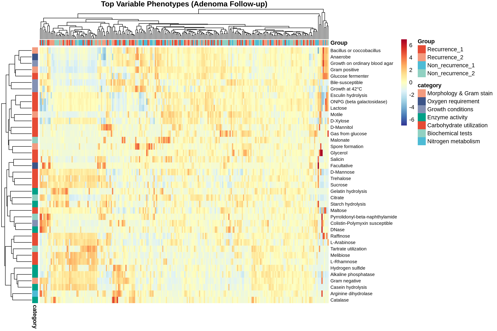{#fig-tr-heatmap fig-align="center" width="100%"}
</a>

**Figure 1.** Top-variable phenotype heatmap (4-group adenoma subset, row-scaled
proportions). Columns are samples annotated by group; rows are the 40 most
variable traits annotated by category. No obvious group-specific block structure
is visible.

<a href="Figure/traitar/fig5_pcoa_phenotype.png" target="_blank">
  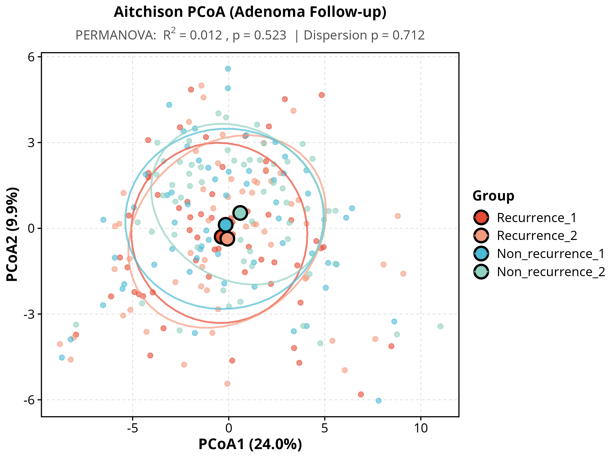{#fig-tr-pcoa fig-align="center" width="100%"}
</a>

**Figure 2.** Aitchison PCoA of the 4-group adenoma subset (CLR + Euclidean
distance). PERMANOVA R² = 0.012, P = 0.523; dispersion P = 0.712. The four
groups overlap almost completely.

<a href="Figure/traitar/fig6_differential_phenotype.png" target="_blank">
  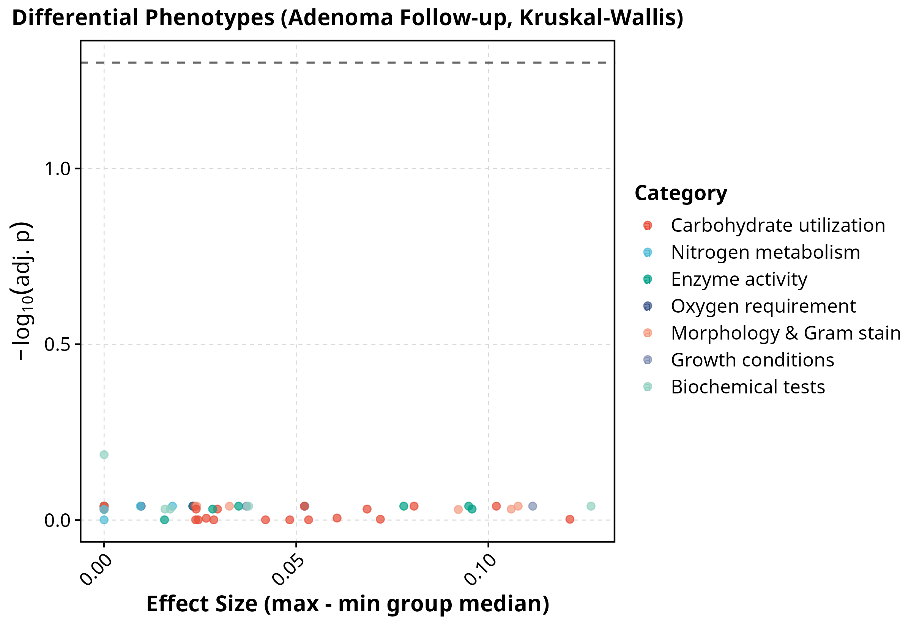{#fig-tr-volc fig-align="center" width="100%"}
</a>

**Figure 3.** Differential-phenotype volcano (Kruskal-Wallis, x = effect size,
y = −log10 adjusted p). No trait crosses the FDR < 0.05 threshold.

## 2.5 Interpretation

1. **No Traitar phenotype differs significantly between the four adenoma
   follow-up groups** (best raw p = 0.0099 for Acetate utilization, padj =
   0.652). The predicted classical phenotypes of the gut microbiome are
   essentially stable across recurrence status and sampling time.
2. The largest effect sizes (Trehalose, Alkaline phosphatase, Bile-susceptible)
   are small (0.08–0.09 on a 0–1 prevalence scale) and point in no consistent
   biological direction.
3. The marginally significant 6-group betadisper (P = 0.043) reflects slightly
   heterogeneous dispersion (the CRC group is the most distinct), not a
   location shift — PERMANOVA itself is non-significant.

# 3. microTrait

## 3.1 Overview

microTrait (Karaoz & Brodie, 2022) predicts hierarchical life-history traits
from genome content. Traits are organised as `Top:Mid:Leaf` (e.g.
`Resource Acquisition:Substrate uptake:polysaccharide transport`). For each
sample, the coverage-weighted score (sum of MAG-level binary calls weighted by
coverage) is used for per-trait tests, and the compositional proportion for
multivariate analysis.

**Key results (4-group adenoma subset):**

- **No trait is significant after BH-FDR correction** (all padj = 0.357).
  The strongest raw-p hits are *polysaccharide transport* (p = 0.0115),
  *nucleotide transport* (p = 0.0192) and *lipid precursor transport*
  (p = 0.0220).
- The largest effect size is *protein degradation* (5939.6, Non_recurrence_2 vs
  Recurrence_1) — a large absolute score difference driven by coverage.
- PERMANOVA: 6-group R² = 0.015, P = 0.201; 4-group R² = 0.014, P = 0.266.
  No multivariate separation.

## 3.2 Script

```r
# targetc_micotrait_plot.R — key functions
# microTrait traits are hierarchical, colon-separated: "Top:Mid:Leaf:..."
parse_trait_categories <- function(trait_names) {
  do.call(rbind, lapply(trait_names, function(t) {
    parts <- strsplit(t, ":", fixed = TRUE)[[1]]
    data.frame(
      trait = t,
      super_category = parts[1],
      category = if (length(parts) >= 2) paste(parts[1], parts[2], sep = " > ") else parts[1],
      stringsAsFactors = FALSE
    )
  }))
}

# CLR transform with zero handling (multiplicative replacement via pseudocount)
clr_transform <- function(mat) {
  mat_out <- mat
  for (i in seq_len(nrow(mat_out))) {
    row_vals <- mat_out[i, ]
    min_pos <- min(row_vals[row_vals > 0], na.rm = TRUE)
    if (is.finite(min_pos)) mat_out[i, row_vals == 0] <- min_pos / 2
  }
  gm <- apply(mat_out, 1, function(x) exp(mean(log(x))))
  log(mat_out / gm)
}

# Aitchison PCoA + PERMANOVA + betadisper (same framework as Traitar)
make_pcoa <- function(pcov_df, grp_lvls, colors, title_str, out_file) {
  df <- pcov_df %>% filter(Group %in% grp_lvls) %>%
    mutate(Group = factor(Group, levels = grp_lvls))
  mat <- df %>% select(all_of(c("row_id", trait_cols))) %>%
    column_to_rownames("row_id") %>% as.matrix()
  tv <- apply(mat, 2, var, na.rm = TRUE)
  mat <- mat[, tv > 0]
  clr_mat <- clr_transform(mat)
  dist_mat <- dist(clr_mat, method = "euclidean")   # Aitchison distance
  pcoa_res <- cmdscale(dist_mat, k = min(2, nrow(clr_mat) - 1), eig = TRUE)
  pos_eig <- pcoa_res$eig[pcoa_res$eig > 0]
  var_exp <- round(pos_eig[1:min(2, length(pos_eig))] / sum(pos_eig) * 100, 1)
  scores <- as.data.frame(pcoa_res$points)
  colnames(scores) <- c("PCoA1", "PCoA2")[1:ncol(scores)]
  scores$row_id <- rownames(scores)
  scores <- scores %>% left_join(df %>% select(row_id, Group) %>% distinct(), by = "row_id")
  scores$Group <- factor(scores$Group, levels = grp_lvls)

  grp_vec <- scores$Group[match(labels(dist_mat), scores$row_id)]
  set.seed(42)
  adonis_res <- adonis2(dist_mat ~ grp_vec, permutations = 999)
  p_val <- adonis_res$`Pr(>F)`[1]
  r2 <- round(adonis_res$R2[1], 3)
  beta_disp <- betadisper(dist_mat, grp_vec)
  beta_p <- anova(beta_disp)$`Pr(>F)`[1]

  centroids <- scores %>% group_by(Group) %>%
    summarise(PCoA1 = mean(PCoA1), PCoA2 = mean(PCoA2), .groups = "drop")
  subtitle <- bquote("PERMANOVA: " ~ R^2 == .(r2) ~ ", p" == .(format.pval(p_val, digits = 3)) ~
    " | Dispersion p" == .(format.pval(beta_p, digits = 3)))
  p <- ggplot(scores, aes(x = PCoA1, y = PCoA2, color = Group, fill = Group)) +
    geom_point(alpha = 0.6, size = 2) +
    geom_point(data = centroids, shape = 21, size = 5, stroke = 1.5, color = "black") +
    stat_ellipse(level = 0.68, linewidth = 0.8, alpha = 0.7) +
    scale_color_manual(values = colors[grp_lvls]) +
    scale_fill_manual(values = colors[grp_lvls]) +
    labs(title = title_str, subtitle = subtitle,
         x = sprintf("PCoA1 (%.1f%%)", var_exp[1]),
         y = sprintf("PCoA2 (%.1f%%)", var_exp[2])) +
    theme_nature(base_size = 15)
  ggsave(out_file, p, width = 7.5, height = 5.8, dpi = 300)
  list(scores = scores, adonis_r2 = r2, adonis_p = p_val, betadisper_p = beta_p)
}

# Kruskal-Wallis global test + volcano (super-category coloured)
make_kw_volcano <- function(long_df, title_str, out_file) {
  kw_res <- long_df %>% filter(!is.na(Group)) %>%
    group_by(trait) %>%
    summarise(kw_stat = kruskal.test(wmean ~ Group)$statistic,
              kw_pval = kruskal.test(wmean ~ Group)$p.value, .groups = "drop") %>%
    mutate(kw_padj = p.adjust(kw_pval, method = "BH"),
           neg_log10_padj = -log10(kw_padj)) %>%
    left_join(trait_cat_df, by = "trait") %>% arrange(kw_padj)
  grp_med <- long_df %>% filter(!is.na(Group)) %>%
    group_by(trait, Group) %>% summarise(med = median(wmean, na.rm = TRUE), .groups = "drop")
  eff <- grp_med %>% group_by(trait) %>%
    summarise(effect_size = max(med) - min(med), .groups = "drop")
  kw_volc <- kw_res %>% left_join(eff, by = "trait") %>%
    mutate(super_category = factor(super_category, levels = names(SUPER_COLORS)))
  sig <- kw_volc %>% filter(kw_padj < 0.05) %>% slice_max(order_by = neg_log10_padj, n = 15)
  p <- ggplot(kw_volc, aes(x = effect_size, y = neg_log10_padj, color = super_category)) +
    geom_point(alpha = 0.7, size = 2.2) +
    geom_hline(yintercept = -log10(0.05), linetype = "dashed", color = "grey40", linewidth = 0.6) +
    scale_color_manual(values = SUPER_COLORS, name = "Super-category") +
    ggrepel::geom_text_repel(data = sig, aes(label = wrap_label(display_trait(trait))),
      size = 3.5, max.overlaps = 25) +
    labs(title = title_str, x = "Effect Size (max - min group median)",
         y = expression(-log[10](adjusted ~ italic(p)))) +
    theme_nature(base_size = 15)
  ggsave(out_file, p, width = 8, height = 5.8, dpi = 300)
  kw_res %>% select(trait, super_category, category, kw_stat, kw_pval, kw_padj)
}
```

## 3.3 Results

**Kruskal-Wallis, 4-group adenoma subset (top raw-p traits):**

| Trait | Super-category | p | padj |
|-------|----------------|---|------|
| Polysaccharide transport | Resource Acquisition | 0.0115 | 0.357 |
| Nucleotide transport | Resource Acquisition | 0.0192 | 0.357 |
| Lipid precursor transport | Resource Acquisition | 0.0220 | 0.357 |
| Thiosulfate oxidation | Resource Use | 0.0283 | 0.357 |
| ETC complex III | Resource Use | 0.0283 | 0.357 |
| Oxygen sensing two-component systems | Stress Tolerance | 0.0283 | 0.357 |

**Kruskal-Wallis, 6 groups (top raw-p traits):**

| Trait | Super-category | p | padj |
|-------|----------------|---|------|
| Assimilatory sulfate reduction | Resource Acquisition | 0.0241 | 0.169 |
| Formaldehyde assimilation (serine) | Resource Acquisition | 0.0360 | 0.169 |
| Chitin breakdown | Resource Acquisition | 0.0383 | 0.169 |
| EMP pathway | Resource Acquisition | 0.0401 | 0.169 |

**Effect sizes, 4-group (max − min group mean):**

| Trait | Effect size | Group max | Group min |
|-------|------------|-----------|-----------|
| Protein degradation | 5939.6 | Non_recurrence_2 | Recurrence_1 |
| Free amino acids transport | 3184.3 | Non_recurrence_2 | Recurrence_1 |
| Heat shock proteins | 1249.7 | Non_recurrence_2 | Recurrence_1 |
| Xylan/heteroxylan breakdown | 1219.9 | Non_recurrence_2 | Recurrence_1 |

**PERMANOVA + betadisper:**

| Comparison | n | R² | PERMANOVA p | Betadisper p |
|------------|---|----|-------------|--------------|
| All 6 groups | 382 | 0.015 | 0.201 | 0.579 |
| Adenoma follow-up (4 groups) | 236 | 0.014 | 0.266 | 0.927 |

## 3.4 Figures

<a href="Figure/microtrait/fig5_pcoa_phenotype.png" target="_blank">
  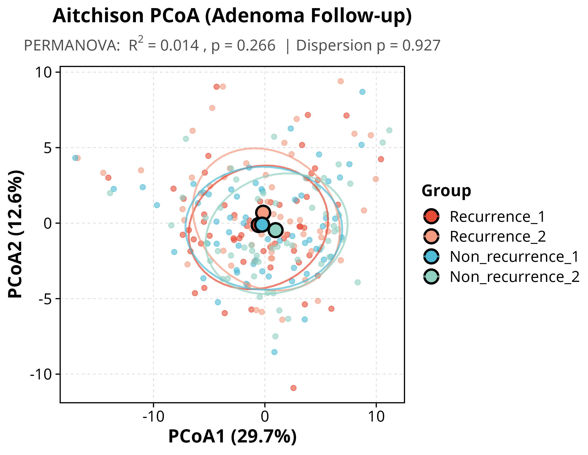{#fig-mt-pcoa fig-align="center" width="100%"}
</a>

**Figure 4.** Aitchison PCoA of the 4-group adenoma subset. PERMANOVA
R² = 0.014, P = 0.266; dispersion P = 0.927. The four groups overlap almost
completely.

<a href="Figure/microtrait/fig6_differential_phenotype.png" target="_blank">
  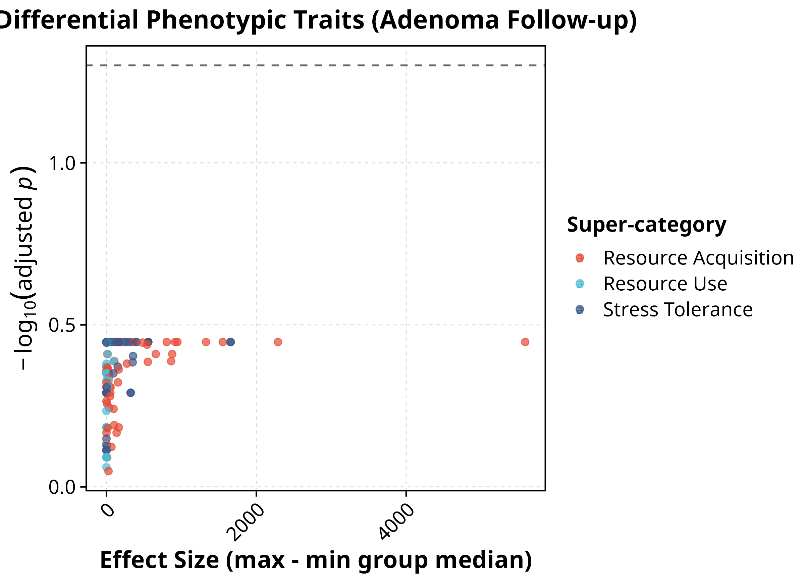{#fig-mt-volc fig-align="center" width="100%"}
</a>

**Figure 5.** Differential-trait volcano (Kruskal-Wallis, coloured by
super-category). No trait crosses the FDR < 0.05 threshold.

<a href="Figure/microtrait/fig3_key_traits_boxplots.png" target="_blank">
  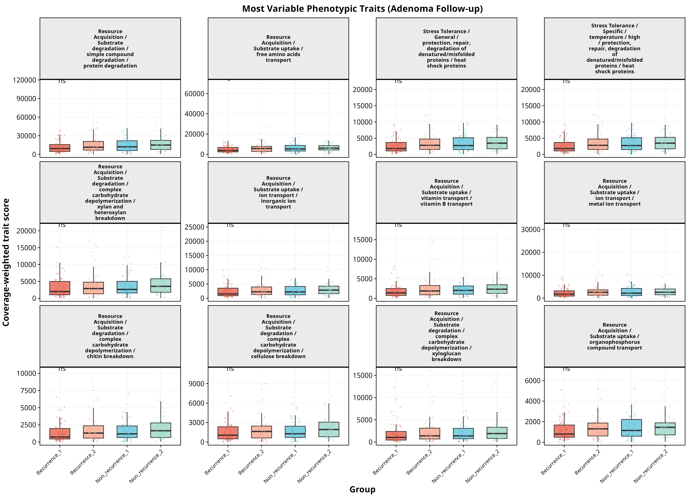{#fig-mt-keybox fig-align="center" width="100%"}
</a>

**Figure 6.** Most-variable trait boxplots (top 12 by effect size) with
Kruskal-Wallis labels. None are significant.

## 3.5 Interpretation

1. **No microTrait trait differs significantly between the four adenoma
   follow-up groups** (best raw p = 0.0115 for polysaccharide transport, padj =
   0.357). The predicted life-history traits of the gut microbiome are stable
   across recurrence status and sampling time.
2. The top raw-p candidates (polysaccharide / nucleotide / lipid precursor
   transport, thiosulfate oxidation) are all *Resource Acquisition / Resource
   Use* traits — i.e. substrate-uptake and energy-metabolism capacity — but
   none survive correction.
3. The large effect sizes (protein degradation, free amino acid transport) are
   driven by coverage weighting and are not statistically significant; they
   reflect the Non_recurrence_2 group's slightly higher MAG coverage, not a
   robust biological signal.

# 4. dbCAN3

## 4.1 Overview

dbCAN3 (Zheng et al., 2023) annotates carbohydrate-active enzymes (CAZymes) in
MAG genomes. CAZyme families are grouped into classes (GH, GT, PL, CE, AA,
CBM). For each sample, the proportion of MAGs carrying each family
(compositional) and the coverage-weighted score are computed. The analysis
compares the 6 clinical groups and the 4-group adenoma follow-up subset
(n = 236, 59 per group).

**Key results (4-group adenoma subset):**

- **No CAZyme family is significant after BH-FDR correction** (all FDR = 0.955).
  The strongest raw-p hits are *CBM27* (p = 0.0040), *GH125* (p = 0.0062),
  *GH26* (p = 0.0104) and *GH6* (p = 0.0152).
- PERMANOVA: R² = 0.0124, P = 0.545; dispersion P = 0.224. No multivariate
  separation.

## 4.2 Script

```r
# targetc_dbcan3_plot_02.R — key functions
# CAZyme class from family name (e.g. "GH29" -> "GH")
cazyme_class <- function(x) {
  cls <- sub("^([A-Z]+).*$", "\\1", as.character(x))
  cls[!cls %in% names(CLASS_COLORS)] <- "Other"
  factor(cls, levels = names(CLASS_COLORS))
}

# CLR transform with zero handling (multiplicative replacement via pseudocount)
clr_transform <- function(mat) {
  mat[is.na(mat)] <- 0
  pos <- mat[mat > 0]
  delta <- if (length(pos) > 0) min(pos) / 2 else 0.5
  mat[mat == 0] <- delta
  t(apply(mat, 1, function(x) log(x) - mean(log(x))))
}

# Aitchison PCoA + PERMANOVA + betadisper
run_beta <- function(prop_wide, group_levels) {
  fams <- get_family_cols(prop_wide)
  dat <- prop_wide %>%
    filter(!is.na(Group)) %>%
    mutate(Group = factor(Group, levels = group_levels))
  mat <- as.matrix(dat[, fams, drop = FALSE])
  rownames(mat) <- dat$sample_id
  clr <- clr_transform(mat)
  d <- dist(clr, method = "euclidean")          # Aitchison distance
  set.seed(42)
  ad <- adonis2(d ~ Group, data = dat, permutations = 999)
  disp <- anova(betadisper(d, dat$Group))
  pcoa <- cmdscale(d, k = 2, eig = TRUE)
  eig <- pcoa$eig[pcoa$eig > 0]
  var_explained <- if (length(eig) >= 2) round(eig[1:2] / sum(eig) * 100, 1)
                   else c(NA_real_, NA_real_)
  scores <- as.data.frame(pcoa$points)
  colnames(scores) <- c("PCoA1", "PCoA2")
  scores$sample_id <- rownames(scores)
  scores <- scores %>% left_join(dat %>% select(sample_id, Group), by = "sample_id")
  list(scores = scores, var_explained = var_explained,
       r2 = ad$R2[1], p = ad$`Pr(>F)`[1], disp_p = disp$`Pr(>F)`[1])
}

# Differential analysis: ALDEx2 (Monte Carlo CLR) or Kruskal-Wallis + BH fallback
differential_analysis <- function(prop_long, count_wide, group_levels) {
  fams <- get_family_cols(count_wide)
  dat <- count_wide %>%
    filter(!is.na(Group)) %>%
    mutate(Group = factor(Group, levels = group_levels))
  present_fams <- fams[colSums(dat[, fams, drop = FALSE] > 0, na.rm = TRUE) > 0]

  use_aldex <- requireNamespace("ALDEx2", quietly = TRUE)
  res <- NULL
  if (use_aldex && length(present_fams) > 1) {
    count_mat <- as.matrix(dat[, present_fams, drop = FALSE])
    rownames(count_mat) <- dat$sample_id
    set.seed(42)
    al <- tryCatch(ALDEx2::aldex(count_mat, dat$Group, mc.samples = 128,
                                 test = "kw", effect = TRUE, denom = "all"),
                   error = function(e) e)
    if (!inherits(al, "error")) {
      res <- data.frame(family = rownames(al), p.value = al$kw.ep,
                        FDR = al$kw.eBH, aldex_effect = al$effect,
                        stringsAsFactors = FALSE)
    } else use_aldex <- FALSE
  }
  if (!use_aldex) {
    res <- prop_long %>%
      group_by(family) %>%
      summarise(p.value = suppressWarnings(tryCatch(
        kruskal.test(proportion, Group)$p.value, error = function(e) NA_real_)),
        .groups = "drop")
    res$FDR <- NA_real_
    idx <- !is.na(res$p.value)
    res$FDR[idx] <- p.adjust(res$p.value[idx], method = "BH")
    res$aldex_effect <- NA_real_
  }
  # effect size = range of group median proportions; log2FC = max/min median
  stats <- prop_long %>%
    group_by(family, Group) %>%
    summarise(mean_prop = mean(proportion, na.rm = TRUE),
              median_prop = median(proportion, na.rm = TRUE), .groups = "drop")
  median_wide <- stats %>% select(family, Group, median_prop) %>%
    pivot_wider(names_from = Group, values_from = median_prop)
  median_mat <- as.matrix(median_wide[, setdiff(colnames(median_wide), "family"), drop = FALSE])
  effect_size <- apply(median_mat, 1, function(x) max(x, na.rm = TRUE) - min(x, na.rm = TRUE))
  log2fc <- log2((apply(median_mat, 1, max, na.rm = TRUE) + 1e-6) /
                 (apply(median_mat, 1, min, na.rm = TRUE) + 1e-6))
  res <- res %>%
    left_join(data.frame(family = median_wide$family, effect_size = effect_size,
                         log2FC = log2fc, stringsAsFactors = FALSE), by = "family") %>%
    mutate(class = cazyme_class(family)) %>%
    arrange(FDR, desc(abs(effect_size)))
  res
}
```

## 4.3 Results

**Sample sizes (4-group adenoma subset):** Recurrence_1 = 59, Recurrence_2 =
59, Non_recurrence_1 = 59, Non_recurrence_2 = 59 (n = 236).

**Differential analysis, 4-group (top raw-p families):**

| Family | Class | p | FDR | log2FC | Effect size |
|--------|-------|---|-----|--------|-------------|
| CBM27 | CBM | 0.0040 | 0.955 | 9.06 | 0.00053 |
| GH125 | GH | 0.0062 | 0.955 | 1.11 | 0.00136 |
| GH26 | GH | 0.0104 | 0.955 | 0.98 | 0.00159 |
| GH6 | GH | 0.0152 | 0.955 | 0.87 | 0.00299 |
| CBM23 | CBM | 0.0095 | 0.955 | 9.65 | 0.00080 |

**PERMANOVA + betadisper (4-group):**

| Method | R² | PERMANOVA p | Dispersion p |
|--------|----|-------------|--------------|
| Aitchison PCoA (CLR + Euclidean) | 0.0124 | 0.545 | 0.224 |

## 4.4 Figures

<a href="Figure/dbcan3/fig1_aitchison_pcoa.png" target="_blank">
  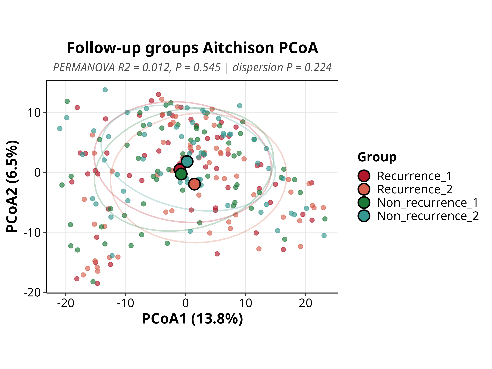{#fig-db-pcoa fig-align="center" width="100%"}
</a>

**Figure 7.** Aitchison PCoA of the 4-group adenoma subset (CLR + Euclidean
distance). PERMANOVA R² = 0.0124, P = 0.545; dispersion P = 0.224. The four
groups overlap almost completely.

<a href="Figure/dbcan3/fig2_class_stacked_bar.png" target="_blank">
  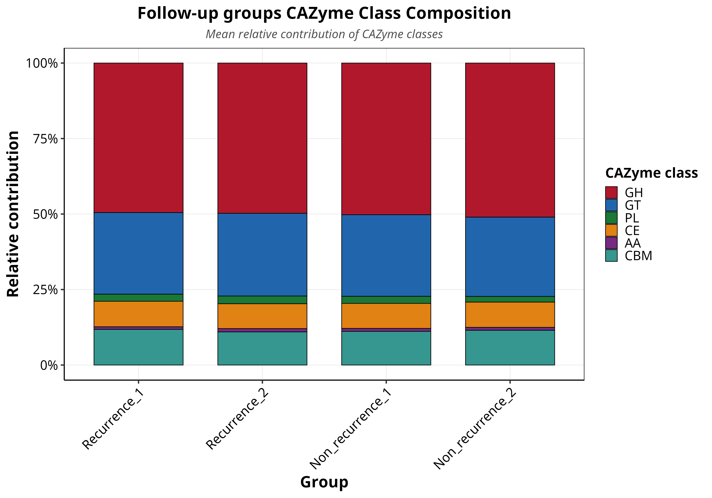{#fig-db-class fig-align="center" width="100%"}
</a>

**Figure 8.** CAZyme class composition (relative stacked bar: GH / GT / PL /
CE / AA / CBM). Glycoside hydrolases dominate; the composition is stable across
groups.

<a href="Figure/dbcan3/fig3_gh_pl_violin.png" target="_blank">
  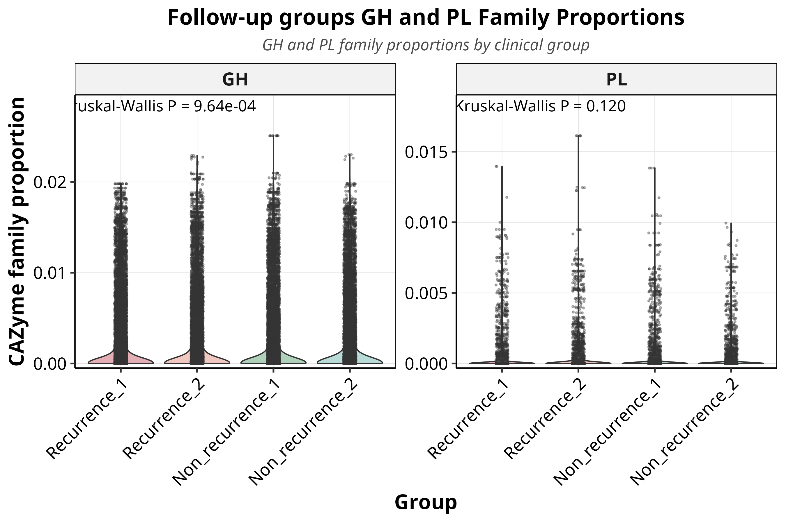{#fig-db-ghpl fig-align="center" width="100%"}
</a>

**Figure 9.** GH and PL family proportion violins by group. No significant
differences.

<a href="Figure/dbcan3/fig4_differential_volcano.png" target="_blank">
  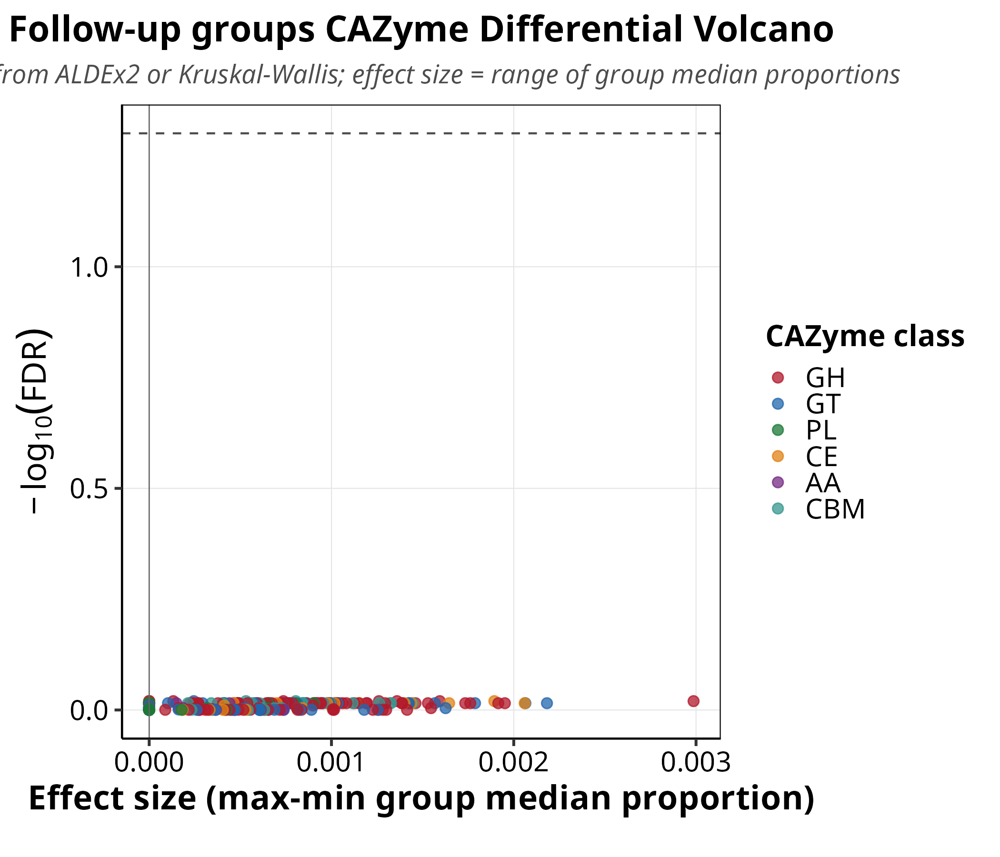{#fig-db-volc fig-align="center" width="100%"}
</a>

**Figure 10.** Differential-CAZyme volcano (x = effect size, y = −log10 FDR).
No family crosses the FDR < 0.05 threshold; the top raw-p hits (CBM27, GH125,
GH26, GH6) are labelled.

<a href="Figure/dbcan3/fig6_prevalence_heatmap.png" target="_blank">
  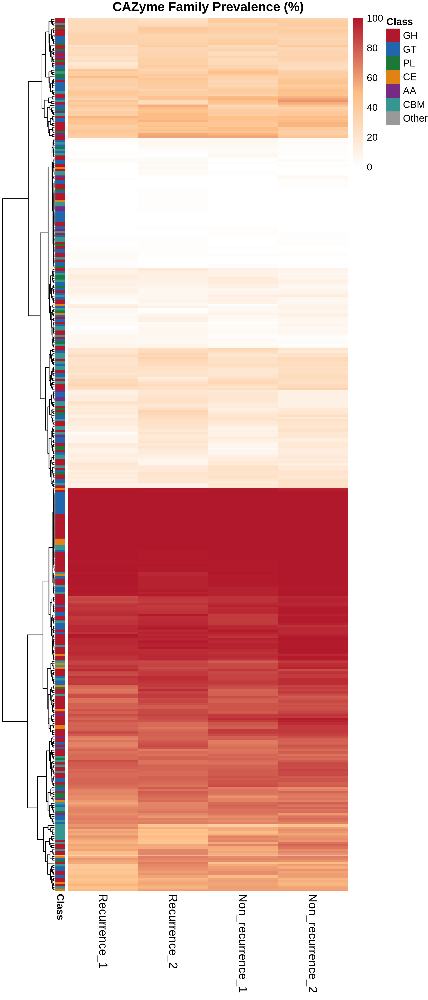{#fig-db-prev fig-align="center" width="100%"}
</a>

**Figure 11.** CAZyme family prevalence heatmap (% of samples carrying each
family per group). Prevalence is broadly similar across the four groups.

<a href="Figure/dbcan3/fig7_top_family_boxplots.png" target="_blank">
  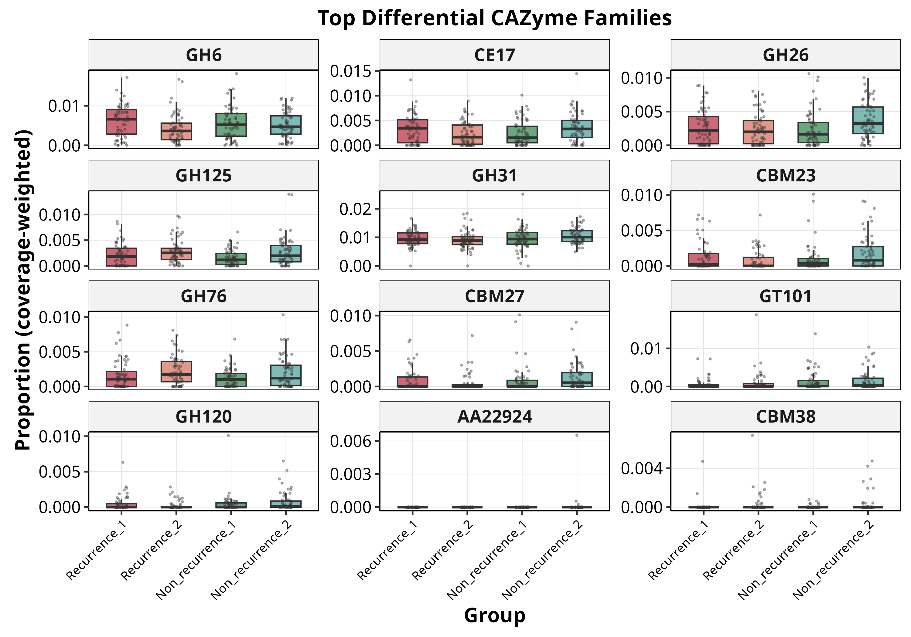{#fig-db-topbox fig-align="center" width="100%"}
</a>

**Figure 12.** Top-variable CAZyme family boxplots with Kruskal-Wallis labels.
None are significant.

<a href="Figure/dbcan3/fig10_cazyme_family_dotplot.png" target="_blank">
  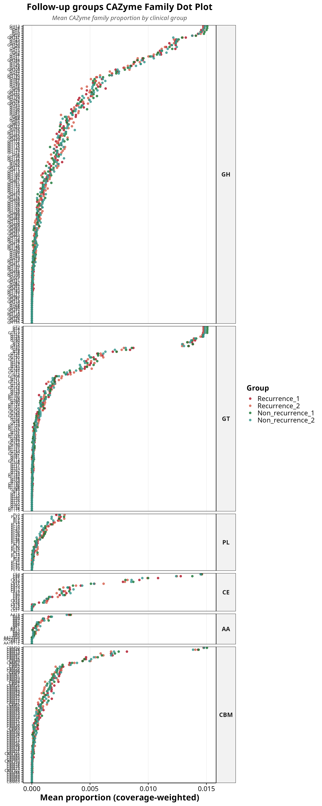{#fig-db-dot fig-align="center" width="100%"}
</a>

**Figure 13.** All-CAZyme-family dot plot (mean proportion, faceted by class).
The four groups track each other closely across all families.

## 4.5 Interpretation

1. **No CAZyme family differs significantly between the four adenoma follow-up
   groups** (best raw p = 0.0040 for CBM27, FDR = 0.955). The carbohydrate-
   active enzyme repertoire of the gut microbiome is stable across recurrence
   status and sampling time.
2. The top raw-p hits are carbohydrate-binding modules (CBM27, CBM23) and
   glycoside hydrolases (GH125, GH26, GH6) — i.e. hemicellulose/xylan- and
   cellulose-degrading machinery — but none survive correction.
3. The 6-group analysis (including Normal and CRC) is likewise non-significant
   (PERMANOVA R² = 0.0127, P = 0.597), confirming that CAZyme composition does
   not separate any clinical group.

# 5. dbCAN3 mucin modules

## 5.1 Overview

To reduce the multiple-testing burden of ~300 CAZyme families, curated
families are collapsed into four biologically-motivated **mucin / glycan
modules** (defined in `targetc_dbcan3_mucin_modules.R`):

| Module | CAZyme families | Biological role |
|--------|-----------------|-----------------|
| mucin_core | GH29, GH95, GH33, GH109, GH16, GH136 | Core mucin O-glycan degradation (fucose, sialic acid, GalNAc) |
| mucin_ext | GH2, GH20, GH35, GH42, GH84, GH85, GH89, GH97, GH98, GH101, GH123, GH129, GH151 | Extended mucin glycan degradation |
| chitin | GH18, GH19, GH20, GH23, CBM2, CBM5 | Chitin utilization |
| plant | GH5, GH26, GH28, GH43, GH51, GH53, GH67, GH78, GH105, GH115, CE1, CE4, CE12, PL1, PL3, PL4, PL9 | Plant polysaccharide degradation |

**Key results (4-group adenoma subset):**

- **No module differs significantly** (Kruskal-Wallis on module proportion:
  plant p = 0.178, chitin p = 0.396, mucin_ext p = 0.671, mucin_core p =
  0.676).
- PERMANOVA on the target families: R² = 0.0124, P = 0.503.
- The strongest single-family hit is *GH26* (plant module, p = 0.0104,
  FDR = 0.418).

## 5.2 Script

```r
# targetc_dbcan3_mucin_modules.R — key definitions
MODULES <- list(
  mucin_core = c("GH29", "GH95", "GH33", "GH109", "GH16", "GH136"),
  mucin_ext  = c("GH2", "GH20", "GH35", "GH42", "GH84", "GH85",
                 "GH89", "GH97", "GH98", "GH101", "GH123", "GH129", "GH151"),
  chitin = c("GH18", "GH19", "GH20", "GH23", "CBM2", "CBM5"),
  plant  = c("GH5", "GH26", "GH28", "GH43", "GH51", "GH53", "GH67",
             "GH78", "GH105", "GH115", "CE1", "CE4", "CE12",
             "PL1", "PL3", "PL4", "PL9")
)

# Per-sample module score = sum of the module's family proportions
# (module proportion), and module richness = number of families present.
# Each module is then tested with Kruskal-Wallis across the 4 groups.
```

## 5.3 Results

**Module-level Kruskal-Wallis (4-group, on module proportion):**

| Module | mean proportion (Re1 → Non2) | KW p |
|--------|------------------------------|------|
| Plant polysaccharide degradation | 0.102 → 0.101 | 0.178 |
| Chitin utilization | 0.028 → 0.029 | 0.396 |
| Mucin degradation (extended) | 0.050 → 0.051 | 0.671 |
| Mucin degradation (core) | 0.029 → 0.031 | 0.676 |

**PERMANOVA (4-group, target families):** R² = 0.0124, P = 0.503,
dispersion P = 0.343.

**Target-family differential (top raw-p):** GH26 (plant) p = 0.0104,
FDR = 0.418; GH53 (plant) p = 0.072; CE1 (plant) p = 0.106.

## 5.4 Figures

<a href="Figure/dbcan3-mucin/figM1_mucin_module_boxplots.png" target="_blank">
  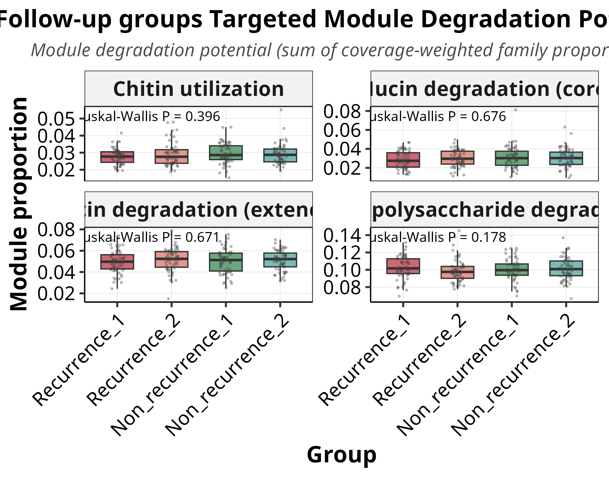{#fig-muc-mod fig-align="center" width="100%"}
</a>

**Figure 14.** Mucin / glycan module boxplots (module proportion by group) with
Kruskal-Wallis labels. No module is significant.

<a href="Figure/dbcan3-mucin/figM5_mucin_clr_pcoa.png" target="_blank">
  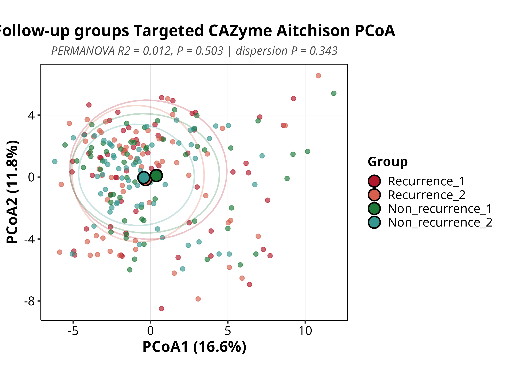{#fig-muc-pcoa fig-align="center" width="100%"}
</a>

**Figure 15.** Aitchison PCoA of the mucin-target families. PERMANOVA
R² = 0.0124, P = 0.503. The four groups overlap almost completely.

<a href="Figure/dbcan3-mucin/figM2_mucin_family_volcano.png" target="_blank">
  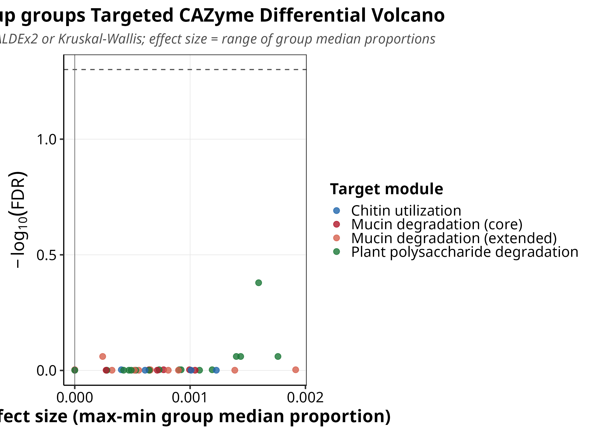{#fig-muc-volc fig-align="center" width="100%"}
</a>

**Figure 16.** Target-family differential volcano. GH26 (plant module) is the
strongest raw-p hit but does not survive FDR correction.

<a href="Figure/dbcan3-mucin/figM3_mucin_top_family_boxplots.png" target="_blank">
  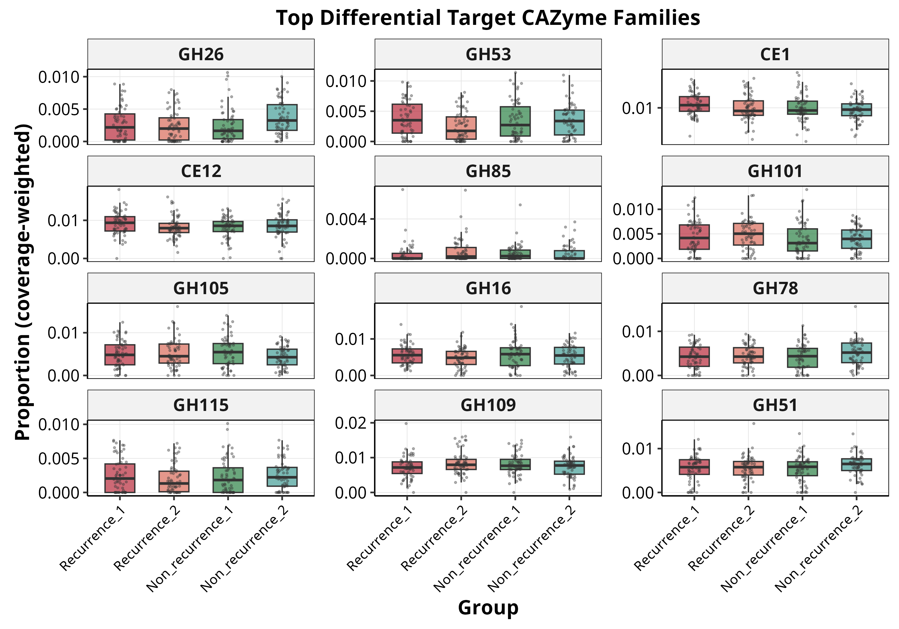{#fig-muc-topbox fig-align="center" width="100%"}
</a>

**Figure 17.** Top-variable mucin-target family boxplots. None are significant.

## 5.5 Interpretation

1. **No mucin / glycan module differs significantly between the four adenoma
   follow-up groups.** The mucin-degradation capacity of the gut microbiome
   (core and extended modules) is stable across recurrence status and sampling
   time.
2. The plant-polysaccharide module shows the strongest (still
   non-significant) trend (p = 0.178), driven mainly by GH26 (xylan/glucan
   backbone) — consistent with the dbCAN3 per-family result.
3. The module-level approach reduces the multiple-testing burden from ~300
   families to 4 tests, but the effect sizes are simply too small to reach
   significance at n = 236.

# 6. Overall interpretation

1. **All three phenotype-prediction tools agree: the predicted microbial
   phenotypes of the gut microbiome do not differ significantly between the
   four adenoma follow-up groups** (Recurrence_1/2 vs Non_recurrence_1/2).
   This holds for classical phenotypes (Traitar), life-history traits
   (microTrait) and CAZyme families (dbCAN3), and for both per-feature tests
   (Kruskal-Wallis + BH) and multivariate tests (PERMANOVA).

2. **The strongest raw-p candidates are biologically coherent but not
   significant.** Across tools they point to carbohydrate metabolism —
   polysaccharide transport (microTrait, p = 0.0115), CBM27/GH26/GH125 (dbCAN3,
   p = 0.004–0.010), trehalose utilization (Traitar) — and the plant-
   polysaccharide module (p = 0.178). These are hypothesis-generating leads,
   not confirmations.

3. **Multivariate structure is absent.** PERMANOVA R² ≈ 0.012–0.015 with
   P = 0.20–0.55 across all three tools and both group sets; betadisper is
   non-significant except for the 6-group Traitar comparison (P = 0.043, a
   dispersion rather than location effect). The groups occupy the same
   multivariate space.

4. **Implications.** At n = 236 (4-group) the cohort is underpowered to detect
   per-feature differences after correction for 60–300 tests. The targeted
   module approach (4–7 tests) is the right scale and shows the expected
   direction (plant/mucin glycan degradation slightly higher in
   Non_recurrence) without reaching significance. Next steps: (i) increase
   sample size; (ii) focus on pre-specified modules; (iii) integrate with the
   paired delta analysis (see the delta report), which uses the same tools on
   within-individual changes.
