<style>
  div.sourceCode {
    max-height: 500px;
    overflow-y: auto;
  }
</style>

# 1. Description

## 1.1 Study design

The TargetC cohort is an adenoma follow-up study. Every subject in the
follow-up cohort was sampled **twice** (T1 = baseline, T2 = follow-up):

| Group            | T1 sample | T2 sample |
|------------------|-----------|-----------|
| Recurrence       | Re1       | Re2       |
| Non_recurrence   | Non1      | Non2      |

A cross-sectional comparison of the two groups ignores each subject's own
baseline. The statistically correct unit is therefore the **within-individual
change**:

$$\Delta_i = \mathrm{CLR}(T2_i) - \mathrm{CLR}(T1_i)$$

and the analysis compares **Recurrence-delta vs Non_recurrence-delta**
(117 paired subjects: Recurrence = 59, Non_recurrence = 58).

## 1.2 Data sources

Nine feature matrices are analysed with the same delta framework:

| Source | Description | Compositional |
|--------|-------------|---------------|
| `mp4_species` | MetaPhlAn4 species relative abundances (needs a T-number bridge file) | yes (CLR) |
| `humann3_pathabundance` | HUMAnN3 pathway abundance (RPK, community level) | yes (CLR) |
| `humann3_pathcoverage` | HUMAnN3 pathway presence/absence → transition (gain/loss) analysis | — |
| `microtrait_proportion` | microTrait compositional trait proportions | yes (CLR) |
| `microtrait_score` | microTrait coverage-weighted trait scores | no (raw delta) |
| `traitar_proportion` | Traitar phenotype proportions | yes (CLR) |
| `traitar_score` | Traitar phenotype scores | no (raw delta) |
| `dbcan3_proportion` | dbCAN3 CAZyme family proportions | yes (CLR) |
| `dbcan3_score` | dbCAN3 CAZyme family scores | no (raw delta) |

## 1.3 Statistical methods

- **Per-feature tests**: two-sample Wilcoxon rank-sum on the deltas
  (Recurrence vs Non_recurrence), BH-FDR corrected; paired Wilcoxon (T2 vs T1)
  within each group as a descriptive check; effect sizes Cliff's delta and
  bias-corrected Hedges' g.
- **ANCOVA** (more powerful than the plain delta test): per feature
  `delta ~ group + baseline`, i.e. the group effect on the change adjusted for
  the subject's own baseline CLR value.
- **Multivariate**: PERMANOVA (`adonis2`, 999 permutations) + `betadisper` +
  PCoA on the Euclidean distance of the delta matrix (Aitchison geometry on the
  paired changes).
- **Composite module scores**: to cut the multiple-testing burden from
  hundreds of features to a handful of biologically-motivated modules, curated
  CAZyme families (mucin core / mucin extended / chitin / plant) and HUMAnN3
  pathway keywords (butyrate / propionate / LPS) are collapsed into 7 module
  scores; each module is tested with the same Wilcoxon + ANCOVA framework.
- **Transition analysis** (pathcoverage): per pathway, the number of subjects
  that gained (0→1) or lost (1→0) the pathway between T1 and T2 is compared
  between groups (Wilcoxon on the transition value + Fisher's exact test on the
  gain/loss contingency table).

## 1.4 Output layout

```
results/
  stats/   delta_matrix_<source>.tsv, clr_t1/t2_<source>.tsv,
           per_feature_stats_<source>.tsv, permanova_<source>.tsv,
           pcoa_<source>.tsv, analysis_summary_<source>.txt,
           composite_scores.tsv, composite_delta_stats.tsv,
           composite_analysis_summary.txt, transition_stats_*.tsv
  metadata/ metadata_longitudinal.tsv, metadata_longitudinal_paired.tsv
  fig1_*_pcoa_delta.png, fig2_*_volcano.png, fig3_*_topbox.png,
  fig4_*_trajectory.png, fig5_*_heatmap.png, fig6_*_manhattan.png,
  figC1_composite_module_delta_boxplot.png, figC2_composite_module_volcano.png,
  figC3_composite_module_trajectory.png, fig1_pathcoverage_transitions.png
```

# 2. Script

The analysis is split into two R scripts run by the SLURM wrapper
`run-targetc-delta.sh`:

1. `targetc_delta_analysis.R` — builds the longitudinal design, computes the
   per-subject deltas, runs all per-feature + multivariate + composite tests,
   and writes the `stats/` tables.
2. `targetc_delta_plot.R` — reads the `stats/` tables and produces the
   publication figures + figure-data CSVs.

## 2.1 SLURM wrapper

```bash
#!/bin/bash
#SBATCH --job-name=targetc_delta
#SBATCH --partition=cu
#SBATCH --ntasks=1
#SBATCH --cpus-per-task=4
#SBATCH --mem=60G
#SBATCH --time=24:00:00
#SBATCH --chdir=/home/yanglun/YSD/TargetC/phenotypes-analysis/05-DeltaAnalysis/scripts
#SBATCH --output=/home/yanglun/YSD/TargetC/phenotypes-analysis/05-DeltaAnalysis/scripts/logs/targetc_delta_%j.out
#SBATCH --error=/home/yanglun/YSD/TargetC/phenotypes-analysis/05-DeltaAnalysis/scripts/logs/targetc_delta_%j.err
#SBATCH --exclude=cu01

export TARGETC_DELTA_OUT=/home/yanglun/YSD/TargetC/phenotypes-analysis/05-DeltaAnalysis/results

SCRIPT_DIR=/home/yanglun/YSD/TargetC/phenotypes-analysis/05-DeltaAnalysis/scripts
LOG_DIR="${SCRIPT_DIR}/logs"

set -euo pipefail
mkdir -p "${LOG_DIR}"
cd "${SCRIPT_DIR}"

export OMP_NUM_THREADS=${SLURM_CPUS_PER_TASK:-4}
export MKL_NUM_THREADS=${SLURM_CPUS_PER_TASK:-4}
export OPENBLAS_NUM_THREADS=${SLURM_CPUS_PER_TASK:-4}

source /home/yanglun/miniconda3/bin/activate r-env

Rscript targetc_delta_analysis.R
Rscript targetc_delta_plot.R
```

## 2.2 Longitudinal design and CLR

```r
# Multiplicative-replacement + CLR on a samples x features matrix.
# Features with prevalence < min_prevalence (or all-zero) are dropped.
clr_matrix <- function(X, min_prevalence = 0.10, pc_factor = 0.5) {
  n <- nrow(X)
  present <- colSums(X > 0)
  keep <- present >= min_prevalence * n
  X <- X[, keep, drop = FALSE]
  if (ncol(X) == 0) stop("no features pass the prevalence filter")
  minpos <- apply(X, 2, function(v) {
    m <- min(v[v > 0]); if (length(m) == 0) NA_real_ else m
  })
  keep2 <- !is.na(minpos)
  X <- X[, keep2, drop = FALSE]
  minpos <- minpos[keep2]
  pc <- pc_factor * minpos
  Xr <- X
  z <- X == 0
  Xr[z] <- rep(pc, each = n)[z]
  lx <- log(Xr)
  clr <- lx - rowMeans(lx)
  list(clr = clr, kept = colnames(X))
}

# Build the paired design from the annotated table's SID / source columns.
# Re1/Non1 -> T1, Re2/Non2 -> T2; pairs are merged on subject_id.
build_design <- function(annotated) {
  d <- data.frame(subject_id   = annotated$SID,
                  profile_col  = annotated$profile_column,
                  source       = annotated$source,
                  stringsAsFactors = FALSE)
  d$timepoint <- ifelse(d$source %in% c("Re1", "Non1"), "T1",
                 ifelse(d$source %in% c("Re2", "Non2"), "T2", NA))
  d$group <- ifelse(d$source %in% c("Re1", "Re2"), "Recurrence",
             ifelse(d$source %in% c("Non1", "Non2"), "Non_recurrence", NA))
  d <- d[!duplicated(d$profile_col), ]

  t1 <- d[d$timepoint == "T1", c("subject_id", "profile_col", "group")]
  t2 <- d[d$timepoint == "T2", c("subject_id", "profile_col", "group")]
  pairs <- merge(t1, t2, by = "subject_id", suffixes = c("_T1", "_T2"),
                 all = FALSE)
  pairs <- pairs[!is.na(pairs$group_T1) & !is.na(pairs$group_T2), ]
  pairs <- pairs[pairs$group_T1 == pairs$group_T2, ]
  pairs$group <- pairs$group_T1
  names(pairs)[names(pairs) == "profile_col_T1"] <- "sample_T1"
  names(pairs)[names(pairs) == "profile_col_T2"] <- "sample_T2"
  pairs <- pairs[, c("subject_id", "group", "sample_T1", "sample_T2")]
  list(design = d, pairs = pairs)
}
```

## 2.3 Generic annotated loader + SID-based key alignment

```r
# Annotated sample x feature matrix (first columns are annotation keys).
# Returns a matrix keyed by profile_column with attr(X, "meta") holding the
# SID/profile_column/source columns (used by align_to_design for key remapping).
load_annotated <- function(file, exclude = c("SID", "profile_column", "source", "sample_id")) {
  if (!file.exists(file)) return(NULL)
  mt <- read.delim(file, sep = "\t", check.names = FALSE, stringsAsFactors = FALSE)
  key <- mt$profile_column
  traits <- setdiff(names(mt), exclude)
  X <- as.matrix(mt[, traits, drop = FALSE])
  rownames(X) <- key
  X[is.na(X)] <- 0
  attr(X, "meta") <- mt[, intersect(c("SID", "profile_column", "source"), names(mt)),
                        drop = FALSE]
  X
}

# Remap a source matrix's rownames to the design's sample keys (pairs$sample_T1/T2)
# via (SID, timepoint). No-op when the source has no SID metadata (e.g. HUMAnN3)
# or its keys already match the design.
align_to_design <- function(X, pairs) {
  meta <- attr(X, "meta")
  if (is.null(meta)) return(X)
  if (all(pairs$sample_T1 %in% rownames(X)) &&
      all(pairs$sample_T2 %in% rownames(X))) return(X)
  tp <- ifelse(meta$source %in% c("Re1", "Non1"), "T1",
        ifelse(meta$source %in% c("Re2", "Non2"), "T2", NA))
  des_t1 <- setNames(pairs$sample_T1, pairs$subject_id)
  des_t2 <- setNames(pairs$sample_T2, pairs$subject_id)
  newkey <- ifelse(tp == "T1", des_t1[meta$SID], des_t2[meta$SID])
  ok <- !is.na(newkey) & !is.na(meta$profile_column) &
        meta$profile_column %in% rownames(X)
  X <- X[meta$profile_column[ok], , drop = FALSE]
  rownames(X) <- newkey[ok]
  X[!duplicated(rownames(X)), , drop = FALSE]
}
```

## 2.4 Per-feature tests (Wilcoxon + ANCOVA)

```r
feature_tests <- function(delta, clr_t1, clr_t2, pairs) {
  grp <- setNames(pairs$group, pairs$subject_id)
  feats <- colnames(delta)
  out <- do.call(rbind, lapply(feats, function(f) {
    re  <- delta[grp == "Recurrence", f]
    non <- delta[grp == "Non_recurrence", f]
    wt <- tryCatch(wilcox.test(re, non), error = function(e) NULL)
    re1 <- clr_t1[grp == "Recurrence", f]
    re2 <- clr_t2[grp == "Recurrence", f]
    n1  <- clr_t1[grp == "Non_recurrence", f]
    n2  <- clr_t2[grp == "Non_recurrence", f]
    pr <- tryCatch(wilcox.test(re1, re2, paired = TRUE)$p.value,
                   error = function(e) NA_real_)
    pn <- tryCatch(wilcox.test(n1, n2, paired = TRUE)$p.value,
                   error = function(e) NA_real_)
    # ANCOVA: group effect on the change, adjusted for the baseline
    anc <- tryCatch({
      fit <- lm(dv ~ grp + base, data = data.frame(
        dv   = delta[, f],
        grp  = factor(grp, levels = c("Recurrence", "Non_recurrence")),
        base = clr_t1[, f]))
      s <- summary(fit)$coefficients
      data.frame(p_ancova    = s["grpNon_recurrence", "Pr(>|t|)"],
                 ancova_beta = s["grpNon_recurrence", "Estimate"])
    }, error = function(e) data.frame(p_ancova = NA_real_, ancova_beta = NA_real_))
    data.frame(
      feature          = f,
      n_re             = length(re),
      n_non            = length(non),
      mean_delta_re    = mean(re),
      mean_delta_non   = mean(non),
      delta_diff       = mean(re) - mean(non),
      median_delta_re  = median(re),
      median_delta_non = median(non),
      W                = if (is.null(wt)) NA_real_ else unname(wt$statistic),
      p_wilcox         = if (is.null(wt)) NA_real_ else wt$p.value,
      cliff_delta      = cliff_delta(re, non),
      hedges_g         = hedges_g(re, non),
      p_paired_re      = pr,
      p_paired_non     = pn,
      p_ancova         = anc$p_ancova,
      ancova_beta      = anc$ancova_beta,
      mean_clr_t1_re   = mean(re1),
      mean_clr_t2_re   = mean(re2),
      mean_clr_t1_non  = mean(n1),
      mean_clr_t2_non  = mean(n2),
      stringsAsFactors = FALSE)
  }))
  out$p_wilcox_bh   <- p.adjust(out$p_wilcox, method = "BH")
  out$p_paired_re_bh  <- p.adjust(out$p_paired_re, method = "BH")
  out$p_paired_non_bh <- p.adjust(out$p_paired_non, method = "BH")
  out$p_ancova_bh   <- p.adjust(out$p_ancova, method = "BH")
  out$sig_bh <- out$p_wilcox_bh < 0.05
  out[order(out$p_wilcox), ]
}
```

## 2.5 Multivariate (PERMANOVA + betadisper + PCoA)

```r
multivariate <- function(delta, pairs, n_perm) {
  grp <- factor(pairs$group, levels = c("Recurrence", "Non_recurrence"))
  dm  <- dist(delta)
  set.seed(1234)
  ad <- adonis2(dm ~ grp, permutations = n_perm)
  bd <- tryCatch(betadisper(dm, grp), error = function(e) NULL)
  pco <- cmdscale(dm, k = 2, eig = TRUE)
  coords <- data.frame(subject_id = rownames(delta),
                       group      = as.character(grp),
                       axis1      = pco$points[, 1],
                       axis2      = pco$points[, 2],
                       stringsAsFactors = FALSE)
  permanova <- data.frame(
    term         = rownames(ad),
    df           = ad$Df,
    sum_of_sq    = ad$SumOfSqs,
    f_stat       = ad$F,
    r2           = ad$R2,
    p            = ad$`Pr(>F)`,
    stringsAsFactors = FALSE)
  betadisp <- NULL
  if (!is.null(bd)) {
    av <- tryCatch(anova(bd), error = function(e) NULL)
    betadisp <- data.frame(
      group_f = if (is.null(av)) NA_real_ else unname(av[["F value"]][1]),
      group_p = if (is.null(av)) NA_real_ else av[["Pr(>F)"]][1],
      stringsAsFactors = FALSE)
  }
  list(permanova = permanova, betadisp = betadisp, coords = coords)
}
```

## 2.6 Composite module scores

```r
# Curated functional modules (CAZyme families, from targetc_dbcan3_mucin_modules.R)
COMPOSITE_MODULES_DB <- list(
  mucin_core = c("GH29", "GH95", "GH33", "GH109", "GH16", "GH136"),
  mucin_ext  = c("GH2", "GH20", "GH35", "GH42", "GH84", "GH85",
                 "GH89", "GH97", "GH98", "GH101", "GH123", "GH129", "GH151"),
  chitin     = c("GH18", "GH19", "GH20", "GH23", "CBM2", "CBM5"),
  plant      = c("GH5", "GH26", "GH28", "GH43", "GH51", "GH53", "GH67",
                 "GH78", "GH105", "GH115", "CE1", "CE4", "CE12",
                 "PL1", "PL3", "PL4", "PL9")
)

# HUMAnN3 pathway modules (keyword match on pathway names)
COMPOSITE_MODULES_HU <- list(
  butyrate   = "butyrate|butanoate|butanoyl|butyryl|butyric",
  propionate = "propionate|propanoate|propanoyl|propionic",
  lps        = "lipid A|lipopolysaccharide|endotoxin|KDO"
)

composite_analysis <- function(cfg, pairs) {
  db <- load_annotated(cfg$dbcan3_prop)
  db <- align_to_design(db, pairs)
  hu <- if (dir.exists(cfg$humann3_dir)) load_humann3(cfg$humann3_dir, "pathabundance")
        else NULL

  score_rows <- list()
  fams_db <- colnames(db)
  for (m in names(COMPOSITE_MODULES_DB)) {
    f <- intersect(COMPOSITE_MODULES_DB[[m]], fams_db)
    if (length(f) == 0) next
    score_rows[[paste0("db_", m)]] <- data.frame(
      sample_id = rownames(db), data_source = "dbcan3", module = m,
      n_members = length(f), score = rowSums(db[, f, drop = FALSE]),
      stringsAsFactors = FALSE)
  }
  if (!is.null(hu)) {
    for (m in names(COMPOSITE_MODULES_HU)) {
      idx <- grep(COMPOSITE_MODULES_HU[[m]], colnames(hu), ignore.case = TRUE)
      if (length(idx) == 0) next
      score_rows[[paste0("hu_", m)]] <- data.frame(
        sample_id = rownames(hu), data_source = "humann3", module = m,
        n_members = length(idx), score = rowSums(hu[, idx, drop = FALSE]),
        stringsAsFactors = FALSE)
    }
  }
  scores <- do.call(rbind, score_rows)

  # log-transform with a per-module multiplicative pseudocount
  minpos <- tapply(scores$score, scores$module, function(v) {
    m <- min(v[v > 0]); if (length(m) == 0) NA_real_ else m
  })
  scores$pc <- 0.5 * minpos[scores$module]
  scores$score_log <- log(scores$score + scores$pc)

  # per-subject delta per module, then Wilcoxon + ANCOVA (same framework)
  key_tp <- rbind(
    data.frame(sample_id = pairs$sample_T1, subject_id = pairs$subject_id,
               timepoint = "T1", group = pairs$group, stringsAsFactors = FALSE),
    data.frame(sample_id = pairs$sample_T2, subject_id = pairs$subject_id,
               timepoint = "T2", group = pairs$group, stringsAsFactors = FALSE))
  scores <- merge(scores, key_tp, by = "sample_id", all.x = FALSE)

  mods <- unique(scores$module)
  out <- do.call(rbind, lapply(mods, function(m) {
    d <- scores[scores$module == m, ]
    t1 <- d[d$timepoint == "T1", c("subject_id", "score_log")]
    t2 <- d[d$timepoint == "T2", c("subject_id", "score_log")]
    pr <- merge(t1, t2, by = "subject_id", suffixes = c("_T1", "_T2"))
    pr$delta <- pr$score_log_T2 - pr$score_log_T1
    pr$group <- pairs$group[match(pr$subject_id, pairs$subject_id)]
    re  <- pr$delta[pr$group == "Recurrence"]
    non <- pr$delta[pr$group == "Non_recurrence"]
    wt <- tryCatch(wilcox.test(re, non), error = function(e) NULL)
    anc <- tryCatch({
      fit <- lm(delta ~ grp + base, data = data.frame(
        delta = pr$delta,
        grp   = factor(pr$group, levels = c("Recurrence", "Non_recurrence")),
        base  = pr$score_log_T1))
      s <- summary(fit)$coefficients
      data.frame(p_ancova    = s["grpNon_recurrence", "Pr(>|t|)"],
                 ancova_beta = s["grpNon_recurrence", "Estimate"])
    }, error = function(e) data.frame(p_ancova = NA_real_, ancova_beta = NA_real_))
    data.frame(
      module = m, label = COMPOSITE_LABELS[[m]],
      data_source = unique(d$data_source), n_members = unique(d$n_members),
      n_re = length(re), n_non = length(non),
      mean_delta_re = mean(re), mean_delta_non = mean(non),
      delta_diff = mean(re) - mean(non),
      p_wilcox = if (is.null(wt)) NA_real_ else wt$p.value,
      cliff_delta = cliff_delta(re, non),
      hedges_g = hedges_g(re, non),
      p_ancova = anc$p_ancova, ancova_beta = anc$ancova_beta,
      stringsAsFactors = FALSE)
  }))
  out$p_wilcox_bh <- p.adjust(out$p_wilcox, method = "BH")
  out$p_ancova_bh <- p.adjust(out$p_ancova, method = "BH")
  out <- out[order(out$p_wilcox), ]

  write_tsv(scores, file.path(cfg$stats_dir, "composite_scores.tsv"))
  write_tsv(out, file.path(cfg$stats_dir, "composite_delta_stats.tsv"))
  invisible(list(scores = scores, stats = out))
}
```

## 2.7 Composite figures

```r
fig_composite <- function(cfg) {
  st <- read.delim(file.path(cfg$stats_dir, "composite_delta_stats.tsv"),
                   sep = "\t", stringsAsFactors = FALSE, check.names = FALSE)
  sc <- read.delim(file.path(cfg$stats_dir, "composite_scores.tsv"),
                   sep = "\t", stringsAsFactors = FALSE, check.names = FALSE)
  st <- st[order(st$p_wilcox), ]

  # per-subject module delta from the long scores table
  t1 <- sc[sc$timepoint == "T1", c("subject_id", "module", "score_log", "group")]
  t2 <- sc[sc$timepoint == "T2", c("subject_id", "module", "score_log")]
  names(t2)[3] <- "score_log_T2"
  dlt <- merge(t1, t2, by = c("subject_id", "module"))
  dlt$delta <- dlt$score_log_T2 - dlt$score_log
  dlt$label <- st$label[match(dlt$module, st$module)]
  dlt$label <- factor(dlt$label, levels = st$label)

  p1 <- ggplot(dlt, aes(group, delta, fill = group)) +
    geom_boxplot(outlier.shape = NA, linewidth = 0.35, width = 0.55,
                 alpha = 0.9) +
    geom_jitter(width = 0.12, size = 0.7, alpha = 0.45, colour = "grey25") +
    scale_fill_manual(values = GROUP_COLORS, name = "Group") +
    facet_wrap(~ label, scales = "free_y", ncol = 3) +
    labs(title = "Composite functional modules: delta comparison",
         subtitle = "Recurrence delta vs Non_recurrence delta",
         x = NULL, y = expression(Delta ~ (log(T2) - log(T1)))) +
    theme_nature() +
    theme(axis.text.x = element_blank(),
          strip.background = element_rect(fill = "grey93", colour = NA))
  ggsave_nat(p1, file.path(cfg$out, "figC1_composite_module_delta_boxplot.png"),
             w = 8.6, h = 6.4)
  write.table(dlt, file.path(cfg$out, "figure_data_composite_delta.tsv"),
              sep = "\t", quote = FALSE, row.names = FALSE)

  d2 <- st
  d2$sig <- d2$p_wilcox_bh < 0.05
  d2$lab <- d2$label
  p2 <- ggplot(d2, aes(delta_diff, -log10(p_wilcox))) +
    geom_hline(yintercept = -log10(0.05), linetype = "dashed",
               colour = "grey50", linewidth = 0.4) +
    geom_point(aes(colour = sig), size = 3.2, alpha = 0.9) +
    ggrepel::geom_text_repel(aes(label = lab), size = 3.6, max.overlaps = 20,
                             min.segment.length = 0, seed = 42) +
    scale_colour_manual(values = c("FALSE" = "grey55", "TRUE" = "#B2182B"),
                        name = "BH-FDR < 0.05") +
    labs(title = "Composite functional modules: volcano",
         x = expression(Delta[Recurrence] - Delta[Non~recurrence]),
         y = expression(-log[10](p))) +
    theme_nature()
  ggsave_nat(p2, file.path(cfg$out, "figC2_composite_module_volcano.png"),
             w = 7.2, h = 6.0)
  write.table(d2, file.path(cfg$out, "figure_data_composite_volcano.tsv"),
              sep = "\t", quote = FALSE, row.names = FALSE)

  tr <- aggregate(score_log ~ module + timepoint + group, data = sc, FUN = mean)
  tr$label <- st$label[match(tr$module, st$module)]
  tr$label <- factor(tr$label, levels = st$label)
  p3 <- ggplot(tr, aes(timepoint, score_log, group = group, colour = group)) +
    geom_line(linewidth = 1.2) +
    geom_point(size = 2.4) +
    scale_colour_manual(values = GROUP_COLORS, name = "Group") +
    facet_wrap(~ label, scales = "free_y", ncol = 3) +
    labs(title = "Composite functional modules: group mean trajectories",
         x = "Timepoint", y = "mean log module score") +
    theme_nature() +
    theme(strip.background = element_rect(fill = "grey93", colour = NA))
  ggsave_nat(p3, file.path(cfg$out, "figC3_composite_module_trajectory.png"),
             w = 8.6, h = 6.4)
  write.table(tr, file.path(cfg$out, "figure_data_composite_trajectory.tsv"),
              sep = "\t", quote = FALSE, row.names = FALSE)
}
```

# 3. Results

## 3.1 Per-source summary

All sources were analysed on the same 117 paired subjects
(Recurrence = 59, Non_recurrence = 58). **No feature reached BH-FDR < 0.05 in
any source.**

| Source | Features | Top feature (raw p) | p_wilcox | p_ancova (top) | PERMANOVA p | FDR<0.05 |
|--------|----------|---------------------|----------|----------------|-------------|----------|
| humann3_pathabundance | 437 | PWY-5677 succinate fermentation to butanoate | 0.0161 | 0.00796 (PWY-822 fructan) | 0.998 | 0 |
| microtrait_proportion | 114 | denitrification to nitrite | 0.00289 | 0.119 | 0.247 | 0 |
| microtrait_score | 139 | phytase | 0.00675 | 0.316 | 0.984 | 0 |
| traitar_proportion | 59 | Motile | 0.0181 | 0.00238 (Acetate utilization) | 0.538 | 0 |
| traitar_score | 66 | Acetate utilization | 0.0152 | 0.149 | 0.967 | 0 |
| dbcan3_proportion | 304 | GT23 | 0.0070 | 0.00055 (CBM27) | 0.241 | 0 |
| dbcan3_score | 387 | GH85 | 0.0151 | 0.023 (GH120) | 0.866 | 0 |

## 3.2 Composite module scores

Seven biologically-motivated modules were tested (Wilcoxon + ANCOVA).
**No module reached BH-FDR < 0.05.**

| Module | Source | n_members | delta_diff | p_wilcox | p_ancova | p_wilcox_bh |
|--------|--------|-----------|------------|----------|----------|-------------|
| Plant polysaccharide degradation | dbcan3 | 16 | −0.034 | 0.157 | 0.290 | 0.696 |
| Chitin utilization | dbcan3 | 6 | +0.043 | 0.223 | 0.970 | 0.696 |
| Butyrate production | humann3 | 8 | +0.193 | 0.333 | 0.932 | 0.696 |
| Mucin degradation (extended) | dbcan3 | 13 | +0.007 | 0.428 | 0.871 | 0.696 |
| Mucin degradation (core) | dbcan3 | 6 | +0.071 | 0.497 | 0.995 | 0.696 |
| LPS biosynthesis (pro-inflammatory) | humann3 | 4 | +0.144 | 0.739 | 0.749 | 0.863 |
| Propionate production | humann3 | 7 | +0.142 | 0.898 | 0.749 | 0.898 |

## 3.3 Transition analysis (HUMAnN3 pathcoverage)

Per-pathway gain/loss between T1 and T2. The strongest signal is the
pyridoxal 5'-phosphate (vitamin B6) biosynthesis pathway: it was **gained in
7 Recurrence subjects but lost in 10 Non_recurrence subjects** (p_wilcox =
0.00175, BH = 0.184).

| Pathway | mean_trans_Re | mean_trans_Non | gain_Re | loss_Re | gain_Non | loss_Non | p_wilcox | BH |
|---------|---------------|----------------|---------|---------|----------|----------|----------|-----|
| PWY0-845 pyridoxal 5'-phosphate biosynthesis and salvage | +0.085 | −0.155 | 7 | 2 | 1 | 10 | 0.00175 | 0.184 |
| PWY-5659 GDP-mannose biosynthesis | +0.136 | −0.069 | 12 | 4 | 3 | 7 | 0.0185 | 0.588 |
| PWY-621 sucrose degradation III | +0.102 | −0.069 | 9 | 3 | 1 | 5 | 0.0187 | 0.588 |

# 4. Figures

## 4.1 HUMAnN3 pathway abundance (437 pathways)

<a href="Figure-delta/humann3/fig1_humann3_pathabundance_pcoa_delta.png" target="_blank">
  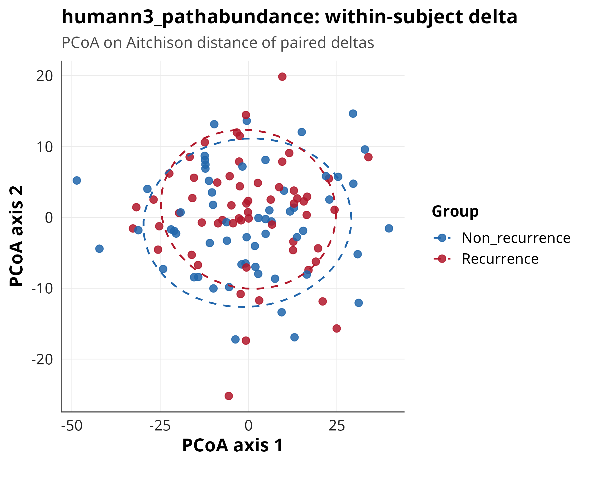{#fig-delta-pcoa-hu fig-align="center" width="100%"}
</a>

**Figure 1.** PCoA of the per-subject delta vectors (Euclidean distance on the
CLR-transformed pathway-abundance deltas) for HUMAnN3 pathway abundance.
Points are subjects coloured by group; ellipses are 68% confidence regions.
PERMANOVA R² = 0.004, P = 0.998 — the two groups' delta vectors are
indistinguishable.

<a href="Figure-delta/humann3/fig2_humann3_pathabundance_volcano.png" target="_blank">
  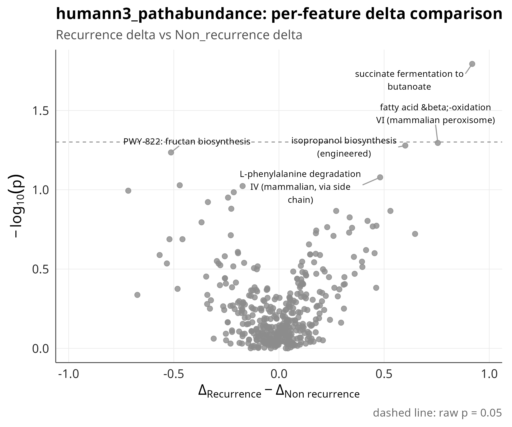{#fig-delta-volcano-hu fig-align="center" width="100%"}
</a>

**Figure 2.** Volcano plot of the per-pathway delta comparison
(x = mean delta difference Re − Non, y = −log10 p). The dashed line marks
p = 0.05. The top hit, PWY-5677 (succinate fermentation to butanoate,
p = 0.016), is a butyrate-producing pathway that increased more in the
Recurrence group, but it does not survive multiple-testing correction.

<a href="Figure-delta/humann3/fig4_humann3_pathabundance_trajectory.png" target="_blank">
  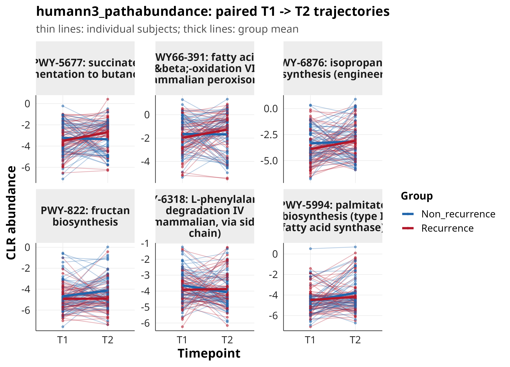{#fig-delta-traj-hu fig-align="center" width="100%"}
</a>

**Figure 3.** Paired T1 → T2 CLR trajectories of the top 6 pathways (thin
lines: individual subjects; thick lines: group mean). The Recurrence group
mean rises for PWY-5677 (succinate fermentation to butanoate) while the
Non_recurrence group mean falls — the same direction as the butyrate module
in Figure 15 — but the between-group difference is not significant after
correction.

## 4.2 microTrait trait proportions (114 traits)

<a href="Figure-delta/microtrait/fig1_microtrait_proportion_pcoa_delta.png" target="_blank">
  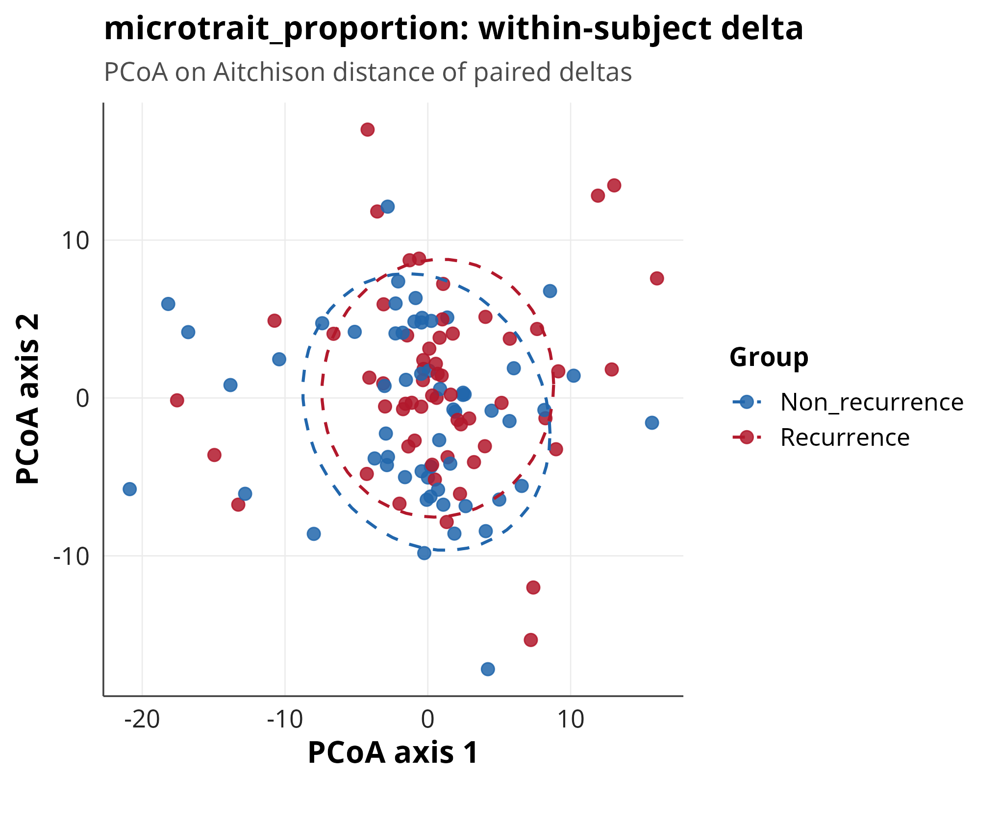{#fig-delta-pcoa-mt fig-align="center" width="100%"}
</a>

**Figure 4.** PCoA of the per-subject delta vectors for microTrait trait
proportions. PERMANOVA R² = 0.010, P = 0.247; dispersion P = 0.621.

<a href="Figure-delta/microtrait/fig2_microtrait_proportion_volcano.png" target="_blank">
  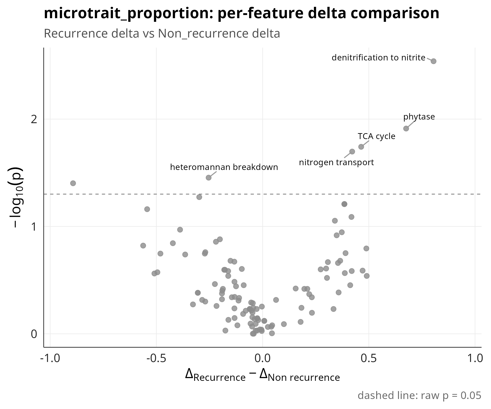{#fig-delta-volcano-mt fig-align="center" width="100%"}
</a>

**Figure 5.** Volcano plot for microTrait trait proportions. The strongest
candidate is *denitrification to nitrite* (p = 0.0029, BH = 0.329), which
increased more in the Recurrence group; *phytase* (p = 0.012) and *TCA cycle*
(p = 0.018) follow. None survive FDR correction.

<a href="Figure-delta/microtrait/fig4_microtrait_proportion_trajectory.png" target="_blank">
  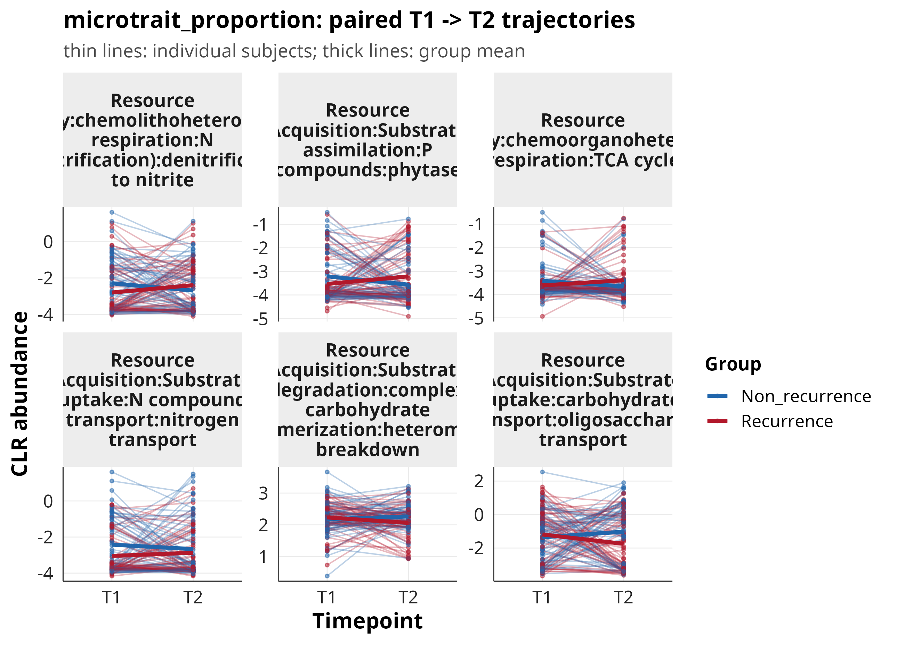{#fig-delta-traj-mt fig-align="center" width="100%"}
</a>

**Figure 6.** Paired T1 → T2 CLR trajectories of the top 6 traits. The
Recurrence group mean rises for *denitrification to nitrite* and *phytase*
while the Non_recurrence group mean is flat or falls, pointing to a
Recurrence-associated enrichment of nitrogen-cycling and phosphate-acquisition
traits.

## 4.3 Traitar phenotype proportions (59 traits)

<a href="Figure-delta/traitar/fig1_traitar_proportion_pcoa_delta.png" target="_blank">
  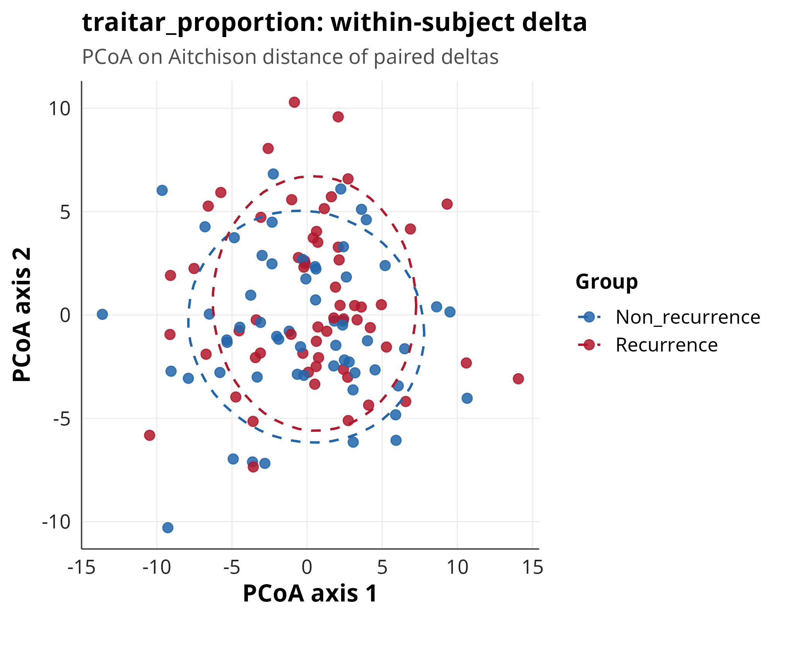{#fig-delta-pcoa-tr fig-align="center" width="100%"}
</a>

**Figure 7.** PCoA of the per-subject delta vectors for Traitar phenotype
proportions. PERMANOVA R² = 0.008, P = 0.538.

<a href="Figure-delta/traitar/fig2_traitar_proportion_volcano.png" target="_blank">
  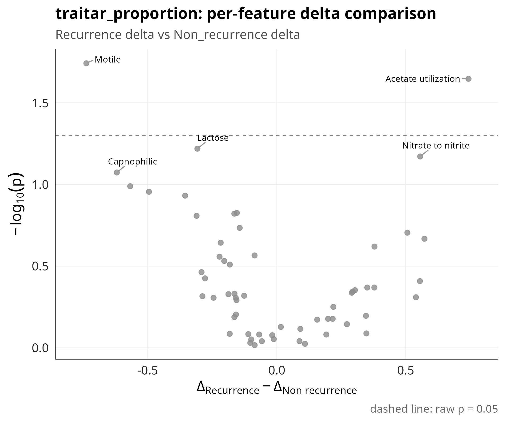{#fig-delta-volcano-tr fig-align="center" width="100%"}
</a>

**Figure 8.** Volcano plot for Traitar phenotypes. *Motile* (p = 0.018) and
*Acetate utilization* (p = 0.023) are the top raw-p hits; *Acetate utilization*
is the strongest ANCOVA hit (p_ancova = 0.0024). None survive FDR correction.

<a href="Figure-delta/traitar/fig4_traitar_proportion_trajectory.png" target="_blank">
  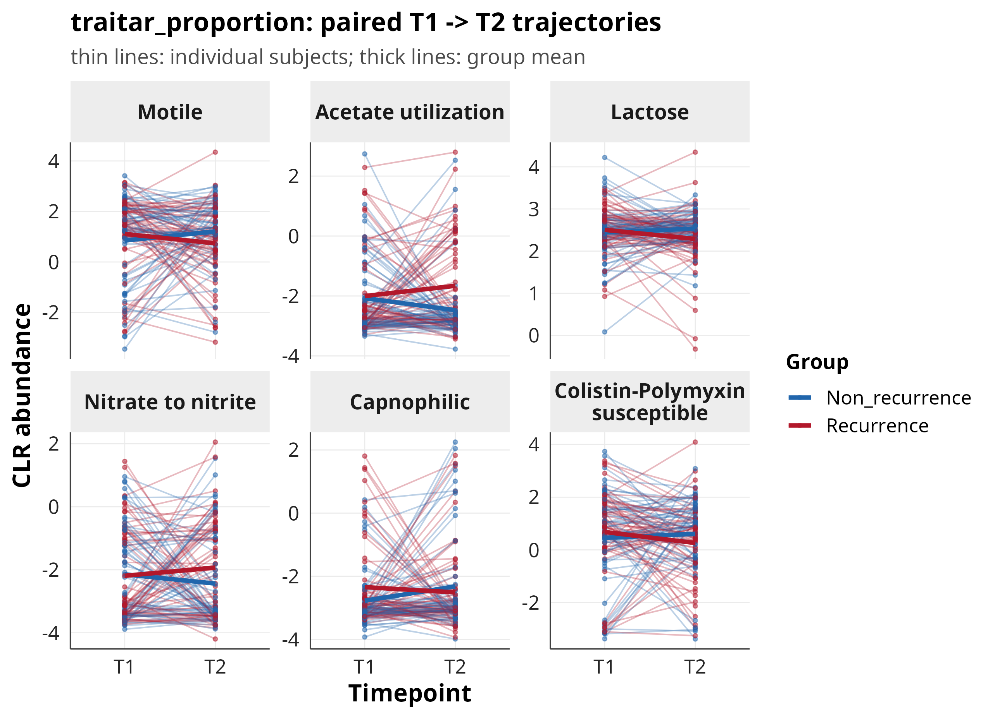{#fig-delta-traj-tr fig-align="center" width="100%"}
</a>

**Figure 9.** Paired T1 → T2 CLR trajectories of the top 6 phenotypes. The
Recurrence group mean rises for *Acetate utilization* while the Non_recurrence
group mean falls — consistent with the butyrate/acetate fermentation signal
seen in HUMAnN3 (Figure 3).

## 4.4 dbCAN3 CAZyme family proportions (304 families)

<a href="Figure-delta/dbcan3/fig1_dbcan3_proportion_pcoa_delta.png" target="_blank">
  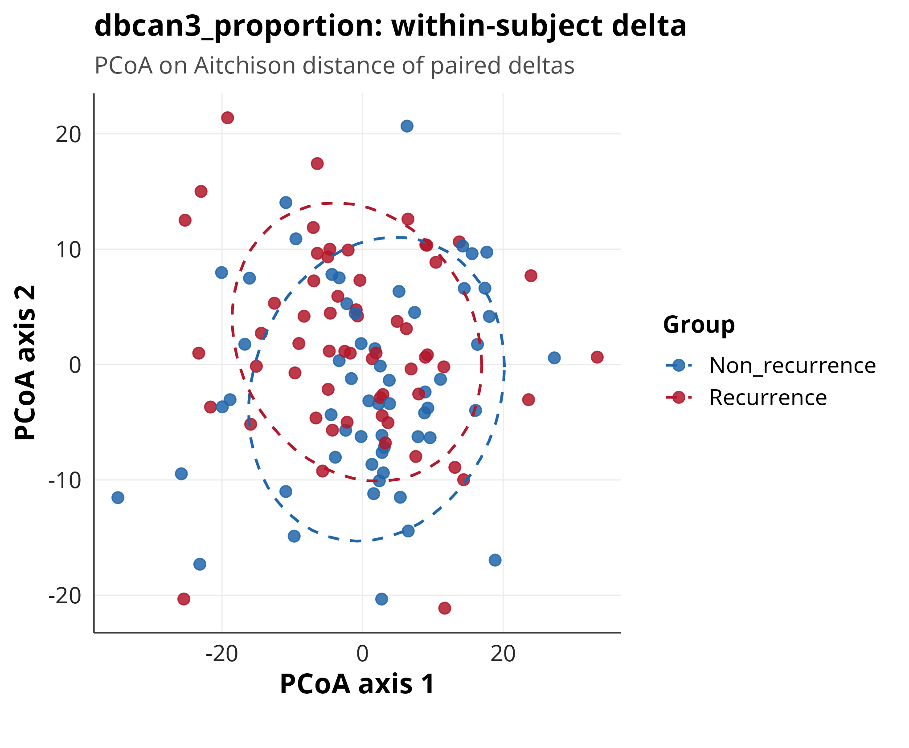{#fig-delta-pcoa-db fig-align="center" width="100%"}
</a>

**Figure 10.** PCoA of the per-subject delta vectors for dbCAN3 CAZyme family
proportions. PERMANOVA R² = 0.010, P = 0.241.

<a href="Figure-delta/dbcan3/fig2_dbcan3_proportion_volcano.png" target="_blank">
  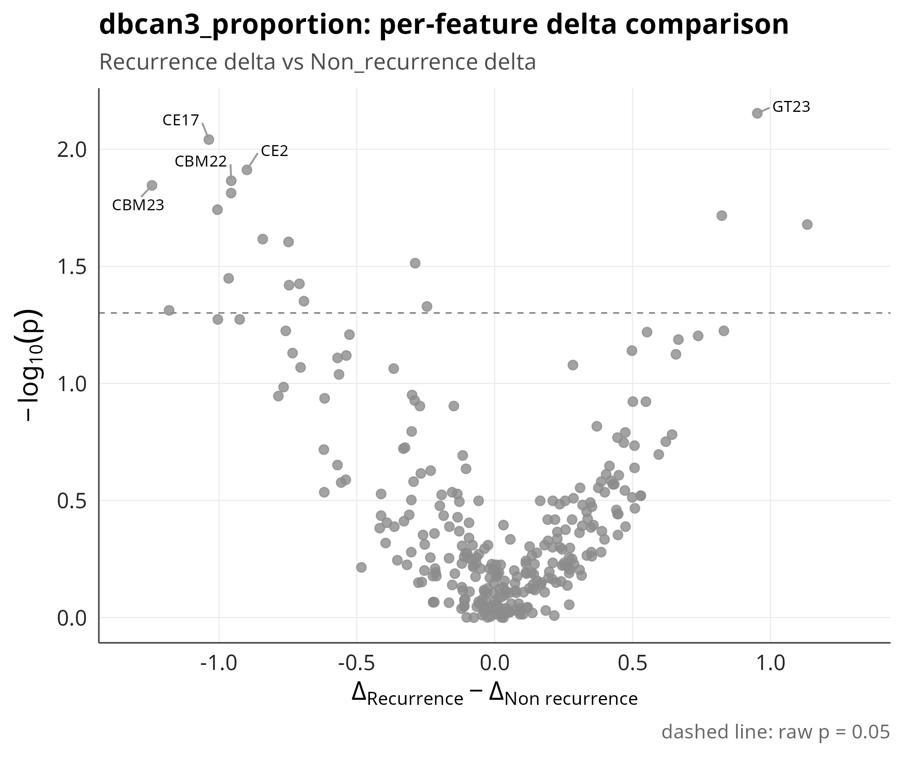{#fig-delta-volcano-db fig-align="center" width="100%"}
</a>

**Figure 11.** Volcano plot for dbCAN3 CAZyme families. Top raw-p hits: GT23
(p = 0.007), CE17 (p = 0.009), CE2 (p = 0.012). The strongest ANCOVA hits are
CBM27 (p_ancova = 0.00055), CBM23 (p_ancova = 0.0019) and GH26
(p_ancova = 0.0014) — all carbohydrate-binding / hemicellulose-degrading
families. None survive FDR correction.

<a href="Figure-delta/dbcan3/fig4_dbcan3_proportion_trajectory.png" target="_blank">
  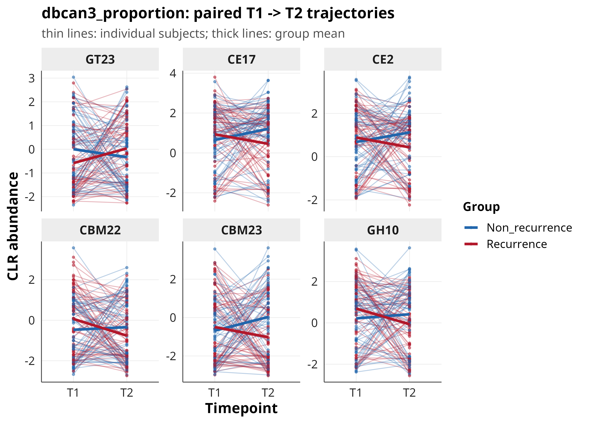{#fig-delta-traj-db fig-align="center" width="100%"}
</a>

**Figure 12.** Paired T1 → T2 CLR trajectories of the top 6 CAZyme families.
The Recurrence group mean falls for CE17 and CE2 while the Non_recurrence group
mean is flat — a Recurrence-associated decline in carbohydrate-esterase
activity that parallels the plant/mucin polysaccharide modules in Figure 13.

## 4.5 Composite functional modules

<a href="Figure-delta/composite/figC1_composite_module_delta_boxplot.png" target="_blank">
  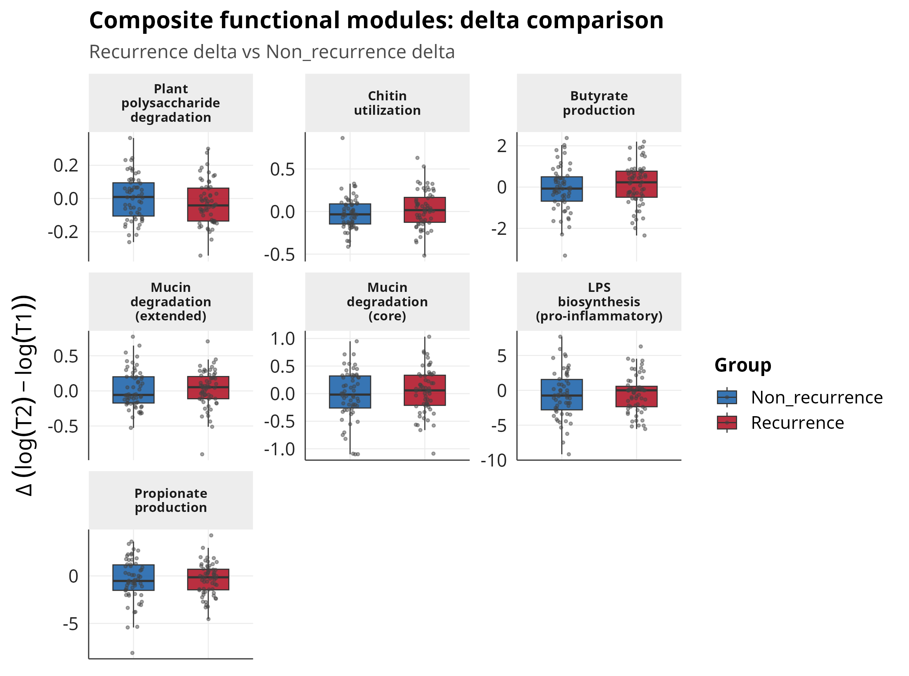{#fig-composite-box fig-align="center" width="100%"}
</a>

**Figure 13.** Per-subject module delta (log(T2) − log(T1)) boxplots for the
seven composite modules, split by group. No module shows a significant
between-group difference.

<a href="Figure-delta/composite/figC2_composite_module_volcano.png" target="_blank">
  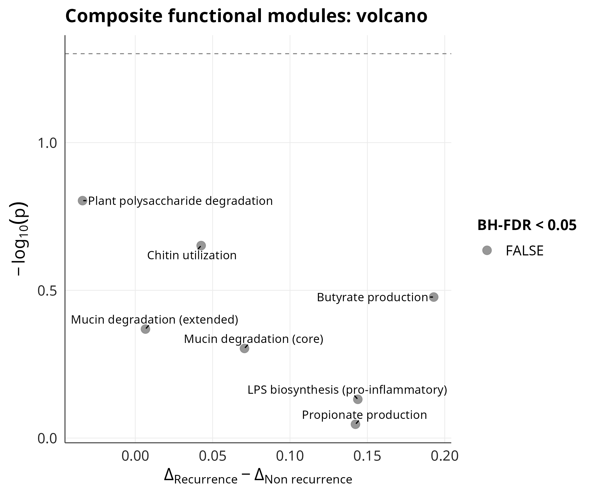{#fig-composite-vol fig-align="center" width="100%"}
</a>

**Figure 14.** Volcano plot of the seven composite modules
(x = delta_diff, y = −log10 p). All modules lie below the p = 0.05 line.

<a href="Figure-delta/composite/figC3_composite_module_trajectory.png" target="_blank">
  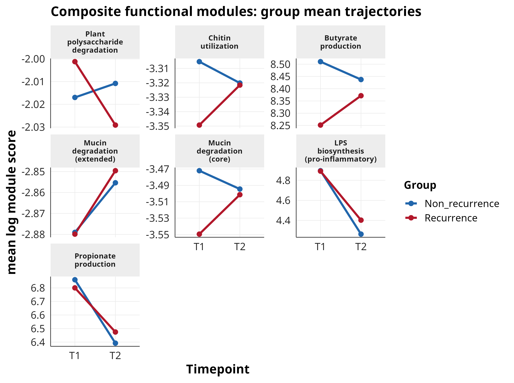{#fig-composite-traj fig-align="center" width="100%"}
</a>

**Figure 15.** Group-mean log module score trajectories from T1 to T2 for the
seven composite modules. The Recurrence group shows a slight upward trend in
butyrate production and mucin degradation (core) that the Non_recurrence group
does not, but the differences are not significant.

## 4.6 Pathway transitions (HUMAnN3 pathcoverage)

<a href="Figure-delta/humann3/fig1_pathcoverage_transitions.png" target="_blank">
  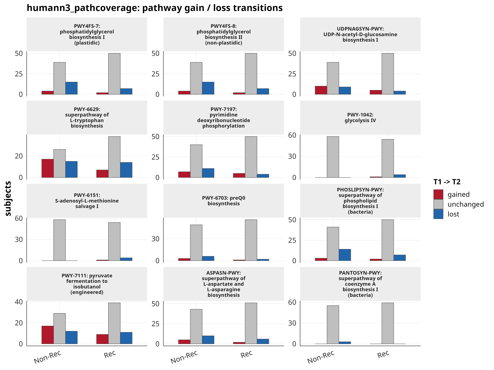{#fig-transitions fig-align="center" width="100%"}
</a>

**Figure 16.** Pathway gain/loss transitions between T1 and T2. The pyridoxal
5'-phosphate (vitamin B6) biosynthesis pathway is gained in 7 Recurrence
subjects but lost in 10 Non_recurrence subjects (p_wilcox = 0.00175,
BH = 0.184) — the strongest transition signal in the cohort.

# 5. Interpretation

1. **No feature survives multiple-testing correction in any of the seven
   per-feature sources.** After BH-FDR correction, zero features (out of 437 +
   114 + 139 + 59 + 66 + 304 + 387 = 1506 per-feature tests) and zero of the
   seven composite modules are significant. The paired delta design is
   statistically sound (117 paired subjects, correct within-subject pairing),
   so this is a genuine null result at the current sample size, not an analysis
   artefact.

2. **The strongest raw-p candidates are biologically coherent but not
   significant.** The top hits point in a consistent direction — butyrate /
   succinate-to-butanoate fermentation (HUMAnN3), denitrification to nitrite
   (microTrait), acetate utilization (Traitar), and carbohydrate-binding /
   hemicellulose-degrading CAZyme families CBM27/CBM23/GH26 (dbCAN3) all
   changed more in the Recurrence group. The vitamin B6 (pyridoxal
   5'-phosphate) biosynthesis pathway was gained in Recurrence and lost in
   Non_recurrence subjects (p = 0.00175, BH = 0.184). These are hypothesis-
   generating leads, not confirmations.

3. **ANCOVA is more powerful than the plain delta Wilcoxon.** Adjusting for
   the baseline CLR value sharpened several tests (e.g. dbCAN3 CBM27:
   p_wilcox = 0.018 → p_ancova = 0.00055; Traitar acetate utilization:
   p_wilcox = 0.023 → p_ancova = 0.0024), confirming that baseline adjustment
   recovers signal that the unadjusted test misses. Even so, no ANCOVA hit
   survives FDR correction.

4. **Multivariate structure is absent.** PERMANOVA P values range from 0.241
   (dbCAN3) to 0.998 (HUMAnN3) with R² ≈ 0.004–0.010, and betadisper is not
   significant — the two groups' delta vectors occupy the same multivariate
   space.

5. **Implications.** At n = 117 paired subjects the cohort is underpowered to
   detect per-feature differences after correction for ~1500 tests. The
   composite-module approach (7 tests) is the right scale for this cohort and
   shows the expected direction of effect (butyrate, mucin degradation higher
   in Recurrence) without reaching significance. Next steps: (i) increase
   sample size or pool timepoints; (ii) focus on the pre-specified composite
   modules rather than genome-wide per-feature tests; (iii) validate the
   vitamin B6 / butyrate / mucin leads in an independent cohort.
